<div align="center">


# org-llm

> **⚠️ ARCHIVED.** org-llm was an earlier, Python-first attempt at an org-roam LLM
> IDE. It is archived and kept read-only for history. The orgbuild ecosystem
> (`orgbuild`, `orgconfer`, `issue-worker`, `orgcore`) is the going-forward line;
> the shared LLM seam is `orgcore-llm`. See orgsuite ADR-0005.

**Your org-roam vault, augmented by FOSS LLMs — and a whole IDE for the second brain that lives there.**

A self-hosted system that indexes your `~/org/` notes into SQLite + sqlite-vec,
embeds them locally via [Ollama](https://ollama.com), then surfaces 50+ MCP
tools to [opencode](https://opencode.ai) (the primary surface), [Pi](https://pi.dev/)
(via a bundled bridge extension), and any other MCP client like
[Claude Code](https://claude.com/code) so any of those agents can read,
write, search, and reason over your second brain natively.
When your laptop runs out of VRAM, route through 6+ cloud providers; when
local Ollama gets stuck, the proactive doctor probes RAM fit and proposes a
downsize/upsize/cloud switch with one-line acceptance. Captain's Log mirrors
every CLI invocation, LLM call, MCP tool call, and config change to BOTH the
SQLite history table AND `~/org/captains-log.org`, so dbt analytics and your
vault search both see the same usage data.

The CLI is themed (LCARS), introspectable (live man page derived from the
Typer registry), self-healing (LLM rescue on every uncaught exception with
opt-in self-rewrite + automatic rollback if the patch doesn't help), and
literate everywhere: config + theme knobs + askbook Q/A all round-trip
through `:tangle`-friendly org files in `~/org/`.

`org-llm` (no args) opens a Doom-Emacs-style splash menu with grouped
shortcuts; first-run users see a setup nudge instead.

</div>

## Multi-agent org-llm — the Bridge Crew

org-llm is built as a roster of named agent personas, not a single
monolithic assistant. The **Bridge Crew** is seven Trek-canonical
handles: `@picard` (manager — decompose / delegate / synthesise),
`@spock` (researcher — workhorse over the vault), `@data` (scribe
— capture-flow + drafting), `@boothby` (hygiene — orphans, drift,
broken links), `@geordi` (analytics — dashboards + Superset surface),
`@atoz` (wiki concept-graph specialist), and `@riker` (general-purpose
project tracker). Each owns a domain, a system prompt, and a tool
slice. You summon them with `@<name>` in any opencode / Pi / Claude
Code session; the proxy resolves the persona, binds the right
enrichments at the @-prefix seam (per DEC-008 — proxy-seam @-prefix
swap), and routes the turn. See
**[docs/wiki/multi-agent-org-llm.org](docs/wiki/multi-agent-org-llm.org)**
for the full crew roster, composition rules, team-shape coordination
patterns, and how to add your own via the extension path
(Phase 2026-05.14.02 — DB-backed registry — user-supplied agents library).

## opencode workspace — your second brain in chat

`org-llm launch` opens [opencode](https://opencode.ai) on your vault
with the proxy + plugin pre-wired. The workspace is the primary way
to use org-llm day-to-day: rounded LCARS sidebar, 64-tool MCP catalog,
cloud-first proxy, auto-doctor, slash commands you can `/sysapply`
when something needs tuning.

> Capture your own opencode screenshots while running and drop them in
> `docs/img/opencode-*.png`. The CLI screenshots in this README are
> Rich-captured SVGs; the opencode TUI is rendered by opentui (Solid),
> which Rich's exporter can't see — so opencode imagery has to come
> from your terminal screenshot tool.

**Recent ships visible in the workspace** (Phase 2026-05.06.02 — cloud-first + synth tools, 2026-05):

- **Cloud-first proxy** (`proxy_cloud_first=true`) — chat completions
  skip the local upstream when hardware can't deliver; routes directly
  through the failover machinery. Onboarding step 6c offers it
  automatically when free RAM < 1.2× the chat-model footprint.
  Tools-using prompts on RAM-constrained hardware: ~40s → ~9.5s.
- **Synthetic tool calls for tool-incapable models** — gemma, gemma2,
  gemma3, phi3, phi3.5, llava all get full MCP/RAG via proxy-side
  prompt-engineered tool calling (`<tool_call>{...}</tool_call>`
  contract). No capability loss when picking a non-tool-native model.
- **Context-overflow retry chain** on cloud failover — 64-tool MCP
  inventory busts the 32k cap; proxy retries with compressed tool
  schemas (drops ~19k → ~3k tokens), falls back to no-tools as a
  last resort.
- **Live model override on the sidebar** — mid-session `/model`
  swaps reflect immediately on the ACTIVE/MODEL cards; cloud-failover
  / cloud-first turns flip the route row from `local` to `cloud`
  with the actual served model.
- **`/sysexport [sidebar]`** — handled in the proxy, returns the
  written file path (and optionally the rendered sidebar markdown)
  as the assistant turn — no LLM round-trip, no hallucination.
- **Auto-doctor** no longer aborts the LLM mid-prefill; it injects
  the diagnostic + numbered proposals (`/sysapply 1,3`) and lets the
  in-flight call finish. Threshold 45s by default.
- **Auto-pull missing role models on launch** + background
  chat-model warmup so the first prompt isn't a cold-load.
- **`org-llm config --check`** — one-shot CLI sanity check against
  ollama/cloud/models/.opencode/doom keybinds/env-vars.

---

## What you get

| | |
|---|---|
| 🚀 **Splash menu** — `org-llm` (no args) opens a Doom-Emacs-style LCARS launcher with grouped shortcuts; first-run users see a setup nudge instead | 🔍 **Semantic search** over your full org-roam graph (`sqlite-vec`, no vector DB) — see [Embeddings](docs/wiki/embeddings.org) + [Vector similarity](docs/wiki/vector-similarity.org) for how it works |
| 💬 **[RAG Q&A](docs/wiki/retrieval-augmented-generation.org)** grounded in your own notes (`org-llm ask "…"`) | 📔 **Askbook** — literate Q/A scratchpad: pose the same question to chat / reason / fast / code / text / cloud / claude / pi backends and see answers side-by-side in `~/org/llm-askbook.org` |
| 🧠 **Hardware-aware FOSS model catalog** — `org-llm models` dashboard with auto-suggestions; `models --benchmark` real tok/s rankings; `models --upgrade` one-shot local + cloud picker | ☁️ **6+ cloud providers** when you outgrow local — RunPod, Vast, Lambda, TensorDock, Salad, Paperspace, CoreWeave, OpenRouter, HuggingFace; auto-refreshing pricing catalog (`cloud --refresh-catalog`) |
| 🛡️ **Encrypted credentials** via the standard Unix `pass` manager — never in plaintext | 🤖 **MCP server** with 50+ tools — every capability exposed to opencode (primary), Pi (via the bundled bridge), and any other MCP client (Claude Code, Cursor, …), with themed LCARS-styled output |
| 🐝 **Pi extension bridge** — `org-llm pi --install` auto-installs Pi if missing, copies a TypeScript MCP-bridge extension to `~/.pi/extensions/`, and wires `~/.pi/config.json`; per-turn dynamic system prompts (something opencode can't do) | 📓 **Org-babel skills** — define LLM workflows as `:skill:`-tagged source blocks |
| 🔬 **Proactive `doctor`** — power-boost probe at launch surfaces upgrades; LLM rescue on every uncaught exception with opt-in self-rewrite + auto-rollback | 🚀 **`launch` / `claude`** — themed workspaces with 51+ slash commands, persona-binding from active dials, stall watcher, optional auto-embedder |
| 🎨 **FOSS tool installer** — `bat`, `eza`, `delta`, `zellij`, … with LCARS/Doom themes | 📊 **dbt analytics + LLM lessons** — `org-llm dbt build/status/doctor/design/walkthrough/lessons`, mart layer over both notes AND the Captain's Log |
| ⚡ **Fish/bash/zsh completions** + shortest-prefix command matching (`do` → `doctor`) | 🪄 **`personalize` + `knob add --llm`** — auto-create theme knobs from your vault, OR build one from a free-form vibe + specifics (font/icon/color/wording) |
| 🛟 **Layered auto-recovery** — every error tries fuzzy-match → LLM intent repair → SRE fix → optional self-rewrite-with-rollback | 🌐 **Cloud↔local routing** — `launch --cloud/--local`, auto-detect when configured, redacted secrets in `--dry-run` |
| 📓 **Captain's Log** — every CLI invocation, LLM call (local + cloud + askbook + claude + pi), MCP tool call, config change mirrored to BOTH SQLite history AND `~/org/captains-log.org` for vault-level analytics; `--reflect` for LLM pattern-spotting | 🗂 **Literate config** — `org-llm config --tangle` writes a round-trippable `~/org/org-llm-config.org` (selective via `--keys`); `--apply-from-org` pushes edits back; theme knobs round-trip too |
| 🔄 **Background auto-embedder** — opt-in daemon thread keeps the index + embeddings fresh without manual `embed` runs; surfaces stats in CLI footers | 📖 **Live man page** — `org-llm man --install` derives a `man 1 org-llm` page from the Typer registry; stays in sync without a build step |
| 🌎 **Env-var override visibility** — every config key has an `ORG_LLM_<KEY>` env tap; `org-llm config` shows the source ([env|config|default]) + env name for every row | 🤖 **LLM copywriting throughout** — Try-it lines, models nudge, doctor closing, tutor recommendation all generated from real state |
| ⚡ **Cloud-first proxy** — `proxy_cloud_first=true` skips the local upstream when hardware can't deliver, routing chat completions through cloud directly. Onboarding step 6c auto-offers it when free RAM < 1.2× the chat-model footprint. Pairs with a context-overflow retry chain (compressed-tools → no-tools) so cloud's 32k cap doesn't block 64-tool MCP requests | 🔧 **Synthetic tool calls for tool-incapable models** — gemma, gemma2, gemma3, phi3, phi3.5, llava all get full MCP/RAG via proxy-side prompt-engineered tool calling (`<tool_call>{...}</tool_call>` contract) — no capability loss when picking a non-tool-native model |
| 🩺 **`config --check`** — one-shot sanity check: ollama reachability, role-model pull status, cloud creds, .opencode/ structure, doom keybinds vs plugin slash registry, ORG_LLM_* env-var validity. Exit 1 on errors, 0 on warnings/clean | 🚀 **Auto-pull on launch + chat-model warmup** — `org-llm launch` fetches any missing role models from ollama AND fires a background warmup ping so your first prompt isn't a cold-load. Preflight context cached 5min so repeat-launches drop to ~2s |
| 📐 **[Semantic-layer registry](docs/wiki/superset.org)** — `org-llm metrics ls/describe/query/emit` exposes named metrics (`metric:llm_avg_ms group_by:[model]`) instead of raw SQL; same registry emits a Superset v1 import bundle so dashboards and the `metrics_query` MCP tool answer with identical numbers | 🍱 **[Phase 2026-07.01 — Apache Superset dashboards — Superset](docs/wiki/superset.org) integration ladder** — 7 tiers from read-only point-and-click → Org-as-source-format importer; emitter + round-trip + Tier 1 dogfood probe shipped; native `uv venv` install path documented (Docker optional) |

---

## Status: beta

Tested end-to-end on Linux (Guix + standard distros). macOS likely
works; Windows isn't supported (no `pass`). Mobile is post-beta —
[Termux port is on the roadmap](#roadmap).

If you hit something broken or weirdly worded, open an issue with
the output of `org-llm log --kind cli --limit 20` — every CLI
invocation is logged with timestamps and that's the fastest way for
me to reproduce.

## First 5 minutes

If you only read one section, this is it:

```sh
# 1. Install (assumes uv — https://docs.astral.sh/uv)
uv tool install --reinstall git+https://github.com/daniel2501/org-llm

# 2. Guided setup — installs Ollama, picks models, indexes ~/org/, etc.
org-llm setup

# 3. Try it — every question is grounded in YOUR notes
org-llm ask "what did I write about cooperative governance lately?"
```

Three things the above quietly does that matter:

- **Index + embed your `~/org/` vault** locally (sqlite-vec). No data
  leaves your machine for the chat side unless you opt into cloud.
- **Pick the right local LLM** for your hardware via `models --tune`.
  If you have <4 GB free RAM it'll route through a free-tier cloud
  provider you connect via `cloud --quick-start openrouter`.
- **Mirror everything to `~/org/captains-log.org`** so you can search
  and analyse your own LLM usage from inside your vault.

After step 3 you have a working second-brain CLI. Read on for the
deeper surfaces (workspaces in opencode/Pi — and integration with
other MCP clients like Claude Code — dbt analytics, self-healing,
theming).

## Install

`org-llm` is a Python tool. The recommended path uses [uv](https://docs.astral.sh/uv/)
so it lives in its own isolated environment and stays off your system Python:

```sh
# Install uv if you don't already have it
curl -LsSf https://astral.sh/uv/install.sh | sh

# Install org-llm itself (or update an existing copy)
uv tool install --reinstall git+https://github.com/daniel2501/org-llm

# Verify
org-llm --help
```

That puts the `org-llm` binary on your PATH (typically `~/.local/bin/org-llm`).

Alternatives:

```sh
# From a local clone (editable / contributor workflow)
git clone https://github.com/daniel2501/org-llm
uv tool install --reinstall ./org-llm

# pipx (also works, slower than uv)
pipx install git+https://github.com/daniel2501/org-llm
```

After install you'll want **Ollama** locally for free chat + embeddings:
`org-llm install-tools --skip-fonts --skip-opencode --skip-gh --skip-claude` does
this for you, or grab it directly from [ollama.com](https://ollama.com).

---

## Quickstart

The fast path — one command:

```sh
org-llm setup
```

`setup` chains 16 ordered steps a new user needs, asking before each
and using real state to make every prompt concrete — e.g.
*"Index and auto-tag your org notes now? (12 unindexed of 245 on disk · 87
untagged node(s))"*. An LLM writes a personalized welcome line at the
start (grounded in your actual filesystem inventory) and three
tailored next-step commands at the end. Steps:

1. **init** — create the SQLite DB
2. **install-tools** — Ollama + opencode + models (skipped if present)
3. **discover** — scan filesystem for org / repo / Emacs roots
4. **doctor** — health check; surface concrete gaps
5. **install FOSS tools** *(only if missing)* — bat / ripgrep / fzf / … with [package-manager fallback](#self-healing) when GitHub releases fail
6. **models --tune** — pick a hardware-fitting set
7. **index** — scan your `.org` files
8. **tag --apply** — LLM auto-tags untagged notes
9. **embed** — vectorise unembedded nodes *(idempotent, runs unconditionally)*
10. **personalize --apply** — auto-create theme knobs from real content
11. **context build** — LLM reads notes; infers durable facts about you
12. **interview** — LLM asks 3-4 clarifying questions about ambiguities it spots in your notes
13. **history build** — narrative summary of older + archived notes
14. **tutor welcome** — print the welcome step
15. **open the full tour** — copies it into your vault, then opens it in `$EDITOR`
16. **(optional) launch opencode** — TTY-takeover; opt-in only, never under `--yes`

Pass `--yes` to run non-interactively. Ctrl-C exits cleanly at any
prompt with partial progress preserved (every step is idempotent).
Long-running subprocesses (Ollama pulls, package-manager installs)
have an LLM-driven [stall watcher](#self-healing) — at >120s silence
the LLM diagnoses the situation and offers `[k]ill / [w]ait / [s]kip`.

The manual path, if you'd rather take steps one at a time:

```sh
# Bootstrap binaries: Ollama, models, fonts, opencode, gh, claude, pass
org-llm install-tools

# Initialize DB, index, embed
org-llm init
org-llm index
org-llm embed

# Confirm health
org-llm doctor

# Ask a question grounded in your notes
org-llm ask "what did I write about cooperative governance last month?"
```

<div align="center">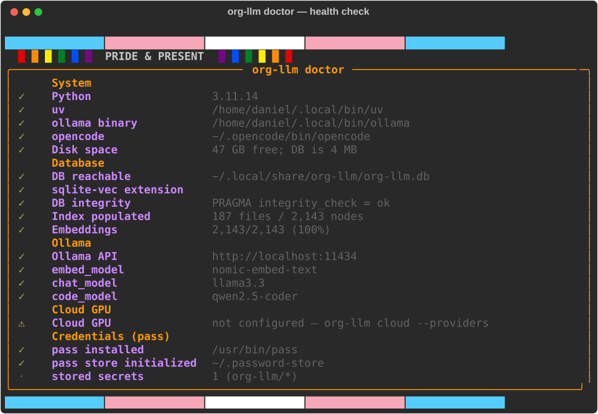</div>

---

## Architecture

```
                                ┌─────────────────────┐
   ~/org/*.org  ──── index ───▶ │  SQLite             │
                                │  + sqlite-vec       │ ◀── dbt views
                                │  + skills + history │     (analytics)
                                │  + config + pass    │
                                └──────────┬──────────┘
                                           │
        ┌──────────────────┬───────────────┼────────────────┬──────────────────┐
        ▼                  ▼               ▼                ▼                  ▼
   ┌─────────┐       ┌──────────┐    ┌──────────┐     ┌──────────┐      ┌────────────┐
   │ Ollama  │       │ MCP      │    │ opencode │     │ Claude   │      │ Cloud GPU  │
   │ (local) │       │ stdio    │ ─▶ │ workspace│     │ Code etc.│      │ (RunPod /  │
   │ chat    │ ◀──── │ 50+ tools│    │          │     │(integration)│   │  Vast / …) │
   │ embed   │       └──────────┘    └──────────┘     └──────────┘      └────────────┘
   └─────────┘
```

The org file at `~/org/20260425230731-org_llm.org` is the literate-programming
source of truth — every Python/SQL/elisp file in this repo is tangled from it.

For the full picture — entry points, SQLite tables, the LLM-proxy interceptor
chain, MCP tool families — see [docs/wiki/architecture.org](docs/wiki/architecture.org).

---

## Commands at a glance

Top-level commands accept the **shortest unique prefix** — `org-llm do` runs
`doctor`, `org-llm review` runs `review-emacs`, ambiguous prefixes error with
candidates listed.

| Command | What it does |
|---|---|
| `org-llm init` | Create the SQLite DB and seed default config |
| `org-llm index` | Parse all `.org` files into the database (incremental by mtime) |
| `org-llm embed` | Generate embeddings for unembedded nodes (`embed_model`) |
| `org-llm code index [PATHS]` · `code search Q` · `code generate T` | Code corpus subgroup — index, search, generate. Top-level aliases `code-index` + `code-gen` for back-compat. |
| `org-llm discover [DIRS]` | Probe filesystem for org/repo/dotfiles/Emacs roots; powers code-index auto-heal |
| `org-llm search "query"` | Semantic or keyword search (`-k` for keyword) |
| `org-llm ask "q"` | RAG Q&A; auto-detects time windows, path hints, and tag references |
| `org-llm capture` | Add a new note (LLM-polished by default; `--no-polish` to skip) |
| `org-llm tag` | Auto-tag untagged nodes (default dry-run; `--apply` to write) |
| `org-llm code "task"` | Generate code with retrieved org context (`--cloud` to route via OpenRouter) |
| `org-llm review-emacs` | LLM review of your Doom/vanilla Emacs config (`--cloud` for low-RAM hosts) |
| `org-llm models` | Discover, tune (catalog-based), assign, or pull FOSS LLMs |
| `org-llm performance` | Hardware-aware tuner — uses *free* RAM + measured tok/s (`--benchmark`) |
| `org-llm cloud` | Multi-provider GPU cloud — signup, configure, status, cost, `--quick-start` |
| `org-llm launch [-w WORKSPACE] [--cloud/--local]` | Open themed opencode TUI: 71 MCP tools, LCARS theme, 51+ slash commands, auto cloud-or-local routing, stall watcher, optional auto-embedder daemon |
| `org-llm claude` | Same, but Claude Code (`ANTHROPIC_API_KEY` from `pass`) |
| `org-llm doctor` | Deep health check + LLM diagnosis (Dr. Crusher persona, live vitals folded in); `--install all` bulk-installs FOSS tools |
| `org-llm doctor -w` | LLM-driven self-test: 13 read-only probes + cloud-LLM judgement |
| `org-llm doctor -r PATH` | Append a structured org-mode report of any doctor run to PATH |
| `org-llm life-support` | 8-probe host telemetry — battery, CPU, memory, disk, thermal, network, Ollama, auto-embedder. `--interval N` for a live polling panel; `--analyze` for LLM optimisation advice with deterministic floors |
| `org-llm sensors` | LCARS resource-monitor dashboard with sparklines; `--drill <probe> --window N` for a per-probe deep-dive (timeseries + status histogram + activity correlations) |
| `org-llm ask --emh "Q"` | Route the question to the Voyager EMH (Emergency Medical Hologram) — answers grounded in `sensor_log`, not the org vault. `--diagnose` for systematic probe-by-probe exam; `--window-hours H` to widen the historical window |
| `org-llm report` | Rich text reports — overview / tags / recent / orphans / daily |
| `org-llm tutor` | 45-step interactive tutorial — start with `tutor welcome` |
| `org-llm db` | Inspect schema, run SELECT queries, full data dictionary |
| `org-llm source <module>` | Print any module's source (with `--explain`) |
| `org-llm mcp` | Start the MCP stdio server (used by opencode and claude) |
| `org-llm grant <path>` / `revoke` / `grants` | Allow LLM file reads via MCP (with deny-list + auto-roots) |
| `org-llm grant-browser` / `revoke-browser` | Toggle LLM browser tools (`open_url`, `browser_command`) |
| `org-llm knob add <name>` | Define your own theme knob (e.g. `dinosaur`, `coffee`) |
| `org-llm personalize [--apply]` | Auto-create theme knobs from your top tags + projects |
| `org-llm context add 'fact'` / `from-prompt` | Record current truth that overrides stale info |
| `org-llm history build [-i]` | LLM scans old + archived notes; writes narrative summary |
| `org-llm stale [--apply]` | LLM-driven staleness sweep over uncategorised notes |
| `org-llm self snapshot [-l label]` | Bundle running package source + DB into rollback-able artifact |
| `org-llm self rollback [ID]` | Restore from snapshot; pre-rollback backup preserved |
| `org-llm self llm-revise <mod> <intent>` | LLM proposes a JSON patch to a module under user review |
| `org-llm completion fish --install` | Install shell completions |
| `org-llm install-tools` | One-shot install Ollama, models, fonts, opencode, gh, claude, pass |

Every command has `--help`. The full setup walkthrough lives in `org-llm tutor`.

---

## FOSS model catalog

`org-llm models --discover` shows the entire FOSS catalog filtered by what
fits your hardware. `--tune` analyzes your current assignments and recommends
upgrades. Every catalog entry is FOSS-licensed (MIT / Apache 2.0 / BigCode
OpenRAIL / Meta Llama Community).

<div align="center">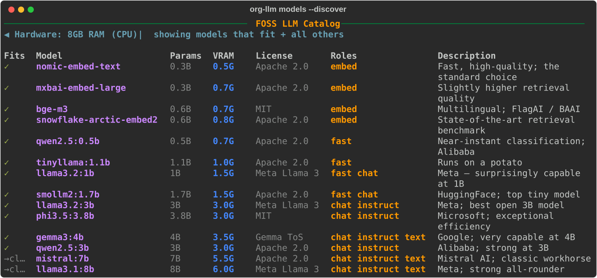</div>

---

## Cloud GPUs

When `org-llm cloud --assess` says a model needs more VRAM than you have, pick
a provider and sign up — the CLI walks you through the rest:

```sh
org-llm cloud --providers          # compare prices and APIs
org-llm cloud --signup vast        # opens browser, prompts for API key
org-llm cloud --configure          # set endpoint URL + key (stored in pass)
org-llm cloud --test               # ping the configured endpoint
```

<div align="center">
  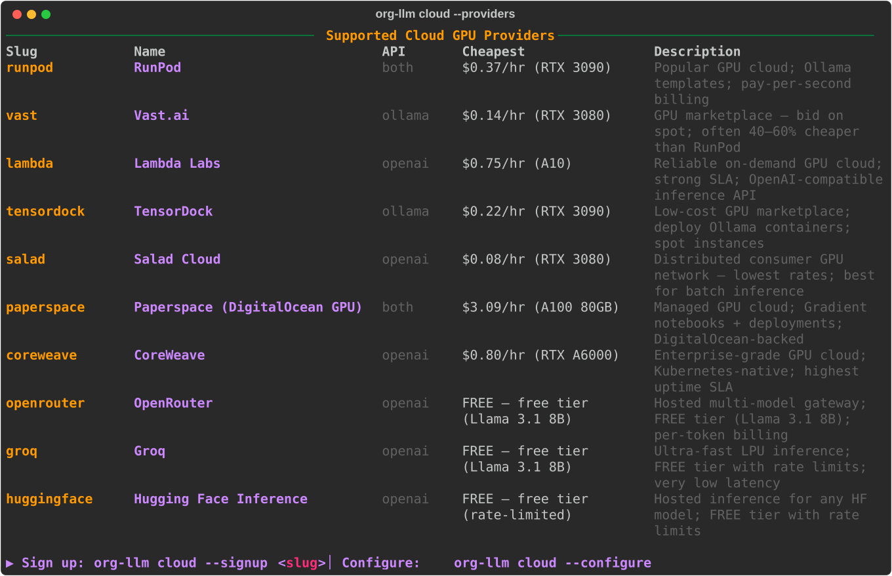
  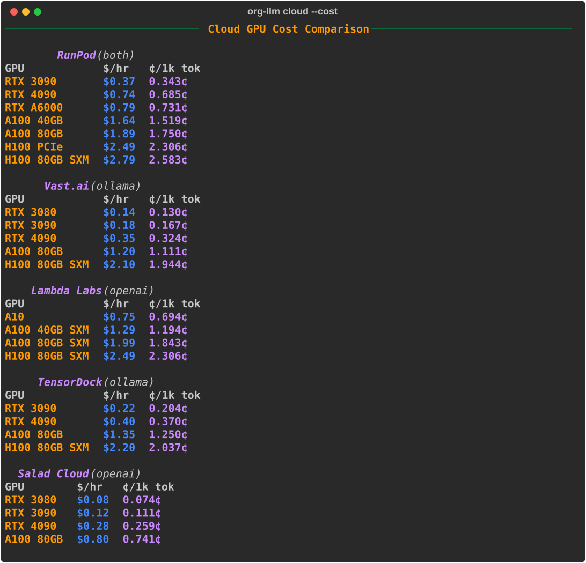
</div>

Supported: **RunPod**, **Vast.ai**, **Lambda Labs**, **TensorDock**,
**Salad Cloud**, **Paperspace**, **CoreWeave**, plus per-token APIs
**OpenRouter** (free Llama 3.1 8B + dozens of paid models, auto-
refreshing pricing) and **Hugging Face Inference**.

### FOSS-first; proprietary models are opt-in

org-llm is FOSS-first. The cloud catalog ships with closed-API models
(Claude, GPT, Gemini) so opting in is one flag away, but they're
**hidden by default** from `cloud --tune` recommendations, the proxy's
cloud-failover routing, and the `claude` subcommand. Open-weight
models (Llama, Qwen, DeepSeek, Kimi, etc.) are the unfiltered default.

To opt in:

```sh
org-llm config proprietary_models_enabled true
```

Each catalog row carries a `license_tier` field — `foss`,
`open_weight`, or `proprietary`. The auto-refresh on launch
classifies new OpenRouter rows into the same tiers, so flipping the
gate is the only step needed to enroll closed models. See
[docs/wiki/cloud-or-local-routing.org](docs/wiki/cloud-or-local-routing.org)
for the full rationale.

---

## Credentials via `pass`

API keys are stored in the standard Unix
[password-store](https://www.passwordstore.org), GPG-encrypted at rest under
`~/.password-store/org-llm/`. Slug layout:

```
org-llm/
├── anthropic/api-key            # for `org-llm claude`
└── cloud/
    ├── runpod/api-key
    ├── vast/api-key
    └── openrouter/api-key
```

`org-llm cloud --configure` will offer to install `pass` if missing and will
**migrate** any existing SQLite-stored keys into pass and clear the plaintext
copy. See `org-llm tutor creds` for the full setup.

<div align="center">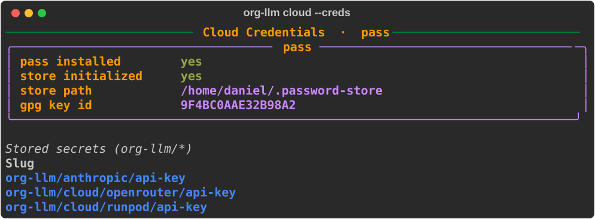</div>

---

## MCP integration

`org-llm mcp` runs an MCP stdio server that exposes **56 tools** to any
MCP-aware client (opencode, Claude Code, …). The toolbox is designed
to give the LLM in opencode parity with the CLI, not a stripped-down
subset.

**Reading notes:**
`search_notes`, `ask_notes`, `get_node`, `list_nodes_by_tag`,
`list_recent_nodes`, `get_vault_stats`, `recent_files`

**Writing / acting:**
`capture_note`, `run_skill`, `tangle_file`, `index_vault`,
`embed_pending`, `set_config` *(allow-listed keys only)*

**Code corpus:**
`code_search` *(language-filterable)*

**Filesystem + ops:**
`discover_filesystem`, `doctor_health`, `performance_status`,
`list_models`, `list_grants`, `request_access`, `read_file`,
`list_directory`

**Host telemetry (life support):**
`life_support_status` *(8-probe vitals snapshot)*,
`life_support_history` *(sensor_log timeseries with activity context)*,
`life_support_advice` *(deterministic-floor optimisation suggestions)*,
`emh_consult` *(Voyager EMH persona — query historical telemetry, two
modes: question + diagnose)*

**Browser (when granted):**
`open_url`, `browser_command`

**Skills + tutor + config:**
`list_skills`, `list_tutor_steps`, `get_tutor_step`, `get_config`,
`set_config`

`set_config` is allow-listed to safe keys only (`chat_model`,
`embed_model`, `code_model`, `temperature`, `code_dirs`, `trek_level`,
…). Credentials, grants, and theme-knob payloads stay inaccessible
from the LLM.

`org-llm launch` wires this up automatically for opencode (writes
`.opencode.json`, `.opencode/themes/`, `.opencode/command/`);
`org-llm claude` does the same for Claude Code (`.claude/settings.json`
+ `.claude/CLAUDE.md`). See [opencode workspace](#opencode-workspace).

---

## opencode workspace

`org-llm launch` is the *other face* of org-llm — a fully themed
opencode TUI with the full MCP toolbox, **CLI-parity slash commands
(31 by default)**, and a system prompt pre-loaded with vault stats,
top tags, models, hardware, filesystem inventory, and any active
theme dials/knobs.

```sh
org-llm launch                       # auto: cloud when configured, else local
org-llm launch --cloud               # force cloud (e.g. OpenRouter free tier)
org-llm launch --local               # force local Ollama
org-llm launch -w researcher         # read-heavy: search/ask/explore
org-llm launch -w scribe             # capture-heavy + skill workflows
org-llm launch -w engineer           # code-corpus + repo focus
org-llm launch --no-theme            # skip writing .opencode/themes/
org-llm launch --no-commands         # skip writing slash-commands
org-llm launch -n                    # dry-run: print config (key redacted), don't launch
```

**Cloud-or-local routing (default: auto):** when a cloud provider is
configured (`org-llm cloud --configure`) and an API key is in `pass`,
`launch` writes `.opencode.json` against that provider so chat skips
slow CPU inference. The config file is chmod'd `0600` because the API
key is embedded; `--dry-run` redacts it. Pass `--local` to force
Ollama for privacy-first sessions.

**Stall watcher:** instead of `os.execvp`'ing into opencode, `launch`
spawns it as a subprocess so a daemon thread can watch
`~/.local/share/opencode/log/*.log`. If the log goes quiet ≥120s
**and** Ollama becomes unreachable, you'll see a one-line diagnosis
after opencode exits — designed to never false-positive while you're
just reading.

What gets written into your vault under `.opencode/`:

- `opencode.json` — model, provider blocks, MCP server, instructions
  (referencing AGENTS.md), `default_agent: "org-llm"` + a custom
  primary `org-llm` agent so the agent picker / status surfaces show
  "org-llm" instead of the generic "build".
- `tui.json` — LCARS theme reference + TUI plugin path (a `file://`
  URI of the `extensions/opencode/` package directory; opencode
  resolves the entrypoint via `package.json#exports["./tui"]`).
- `insight-cards.json` — Phase 2026-04.07 — insight cards insight cards the TUI plugin renders
  in the `/insights` dialog. Re-gathered on every launch.
- `AGENTS.md` — opencode's standard project-context file. ~80-line
  primer: "this workspace has org-llm; here's the search-first rule
  and the tool cheatsheet." Loaded via `instructions[]` so every
  session that mounts this config picks it up.
- `themes/org-llm-lcars.json` — LCARS palette (orange / purple / blue)
  matching the CLI, both light and dark variants.
- `command/<name>.md` — **51+ slash-commands** that mirror the CLI
  surface, grouped by intent:
  - *Querying* — `/search`, `/ask`, `/capture`, `/context`, `/stale`
  - *Code* — `/code` (search), `/code-gen`, `/code-index`
  - *Indexing* — `/index`, `/embed`, `/tag`, `/report`
  - *Models* — `/models`, `/cloud`, `/config`, `/performance`
  - *Skills* — `/skills`, `/skill`, `/skill-new`
  - *Health* — `/discover`, `/recent`, `/health`, `/doctor`, `/stats`,
    `/tags`, `/grants`
  - *Other* — `/tutor`, `/source`, `/history`, `/personalize`, `/run`
  - Plus workspace extras: `/explore` (researcher), `/repo` (engineer).
  - `/run` is the **universal escape hatch** — invoke any allow-listed
    CLI verb via `org_llm_run`, with the same shell-quote-repair and
    intent-reconstruction the CLI itself uses.

The system prompt also surfaces your **active theme knobs**
(`trek_level`, `commie_level`, `queer_level`, plus user-defined knobs
like `dinosaur`) so the in-opencode model matches the energy of your
CLI.

### TUI plugin & branding

`extensions/opencode/` is a TypeScript plugin opencode loads via its
embedded bun runtime. It does two things:

1. **Insight cards on open.** Reads `.opencode/insight-cards.json` and
   pops a `DialogSelect` of cards as soon as the TUI mounts — no need
   to type `/insights`. Selecting a card prefills the prompt with its
   suggested question. The dialog is dismissable with Escape; the
   `/insights` slash command (alias `/i`) re-opens it. A toast acts
   as a fallback breadcrumb if the dialog is closed.
2. **Slot overrides for branding.** opencode's TUI is a SolidJS app
   with `Slot` elements for surfaces like `home_logo` and
   `sidebar_title`. The plugin registers replacements:
   - `home_logo` — replaces the welcome-screen "opencode" wordmark
     with an org-llm ASCII wordmark + LCARS chunk-bar accent.
   - `sidebar_title` — prepends `org-llm •` to every per-session
     header so each session is visibly an org-llm session.

Identity in chat is handled separately by the system prompt's
`IDENTITY` block (in `_opencode_workspace_prompt`) which routes
through `agent.org-llm.prompt` — opencode's `instructions[]` array is
append-only, but `agent.<name>.prompt` actually overrides the default
identity. Combined with `default_agent: "org-llm"`, every visible
surface (chrome + chat + sidebar + agent picker) reads as "org-llm".

Rule of thumb: if you'd otherwise pipe four CLI commands together,
opencode is probably the right tool.

### LCARS palettes (CLI splash + TUI sidebar)

Splash screen + every themed surface (panels, banners, opencode
greeting, MCP tool decorations) re-skins to whichever LCARS palette
is active. Switch with one command — no rebuild, no editor open, no
config file edit. Per-channel hex overrides via `--primary` /
`--secondary` / `--tertiary` stack on top.

```sh
org-llm palette                            # text-based palette picker
org-llm palette red                        # red-alert mode
org-llm palette green                      # Voyager astrometrics
org-llm palette gold --primary '#FFD60A'   # gold + custom override
org-llm palette reset                      # back to classic
```

<div align="center">
  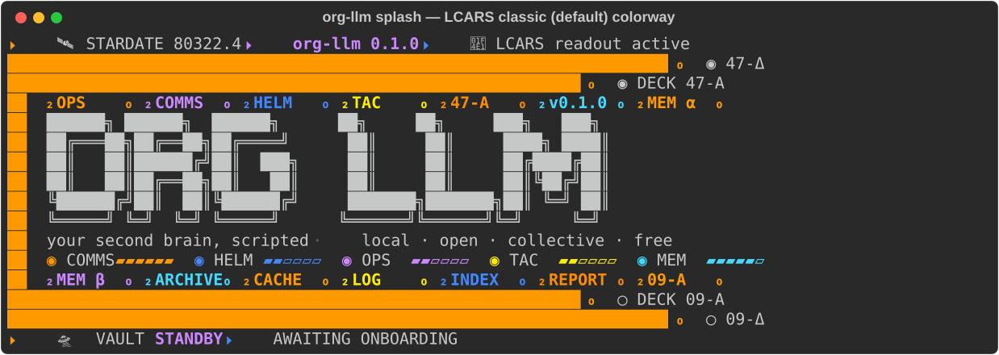
</div>

<details>
<summary>Other palettes (red / green / gold / violet)</summary>

<table>
<tr>
  <td align="center"><b>red</b><br/><sub>red · salmon · amber</sub><br/>
    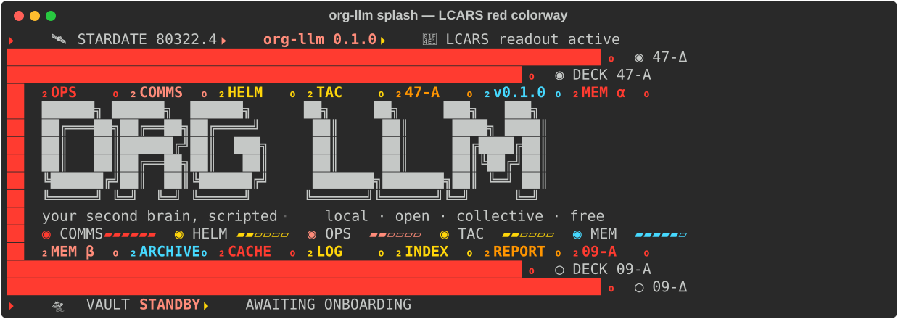</td>
  <td align="center"><b>green</b><br/><sub>green · sky · gold</sub><br/>
    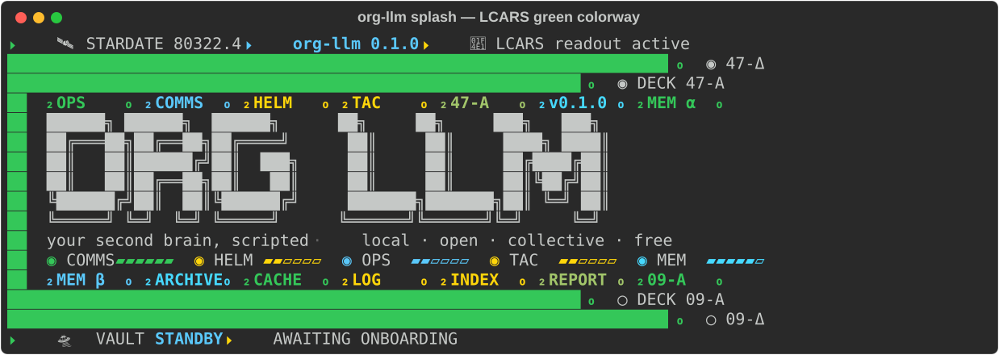</td>
</tr>
<tr>
  <td align="center"><b>gold</b><br/><sub>gold · amber · red</sub><br/>
    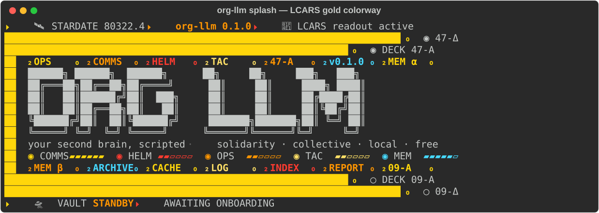</td>
  <td align="center"><b>violet</b><br/><sub>violet · magenta · sky</sub><br/>
    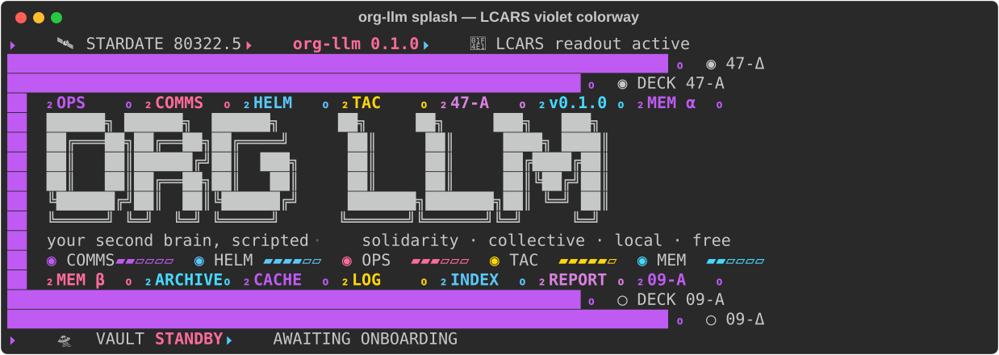</td>
</tr>
</table>
</details>

---

## Pi bridge — third conversational interface

`org-llm pi --install` auto-installs Pi (pi.dev) if missing, copies a
TypeScript MCP-bridge extension to `~/.pi/extensions/`, and registers
it in `~/.pi/config.json`. Once installed, every Pi session starts with
all 71 org-llm MCP tools registered as `org_llm_<name>` Pi tools, plus
a per-turn dynamic system prompt (something opencode itself can't do).

```sh
org-llm pi --install     # auto-install Pi + bridge, idempotent
org-llm pi --status      # verify bridge + registration + tool count
org-llm pi               # start a Pi session with org-llm tools loaded
org-llm pi --reinstall   # rebuild the bridge from bundled TypeScript
```

<div align="center">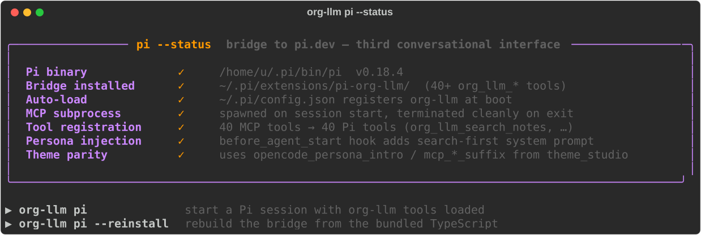</div>

Theme parity: the same `opencode_persona_intro` /
`mcp_tool_success_suffix` / `mcp_tool_error_suffix` surfaces from
`theme_studio` that decorate opencode also feed Pi, so the active
LCARS palette + dial voices show up identically across the
conversational surfaces (opencode · Pi · any other MCP client like
Claude Code).

---

## Smart RAG retrieval

> Background reading: [Retrieval-Augmented Generation (RAG)](docs/wiki/retrieval-augmented-generation.org)
> in the wiki — the substrate everything below leans on.

`org-llm ask` does more than pure [vector similarity search](docs/wiki/vector-similarity.org).
It auto-detects three intents in your query and adjusts retrieval
accordingly:

- **Temporal phrases** — `"last week"`, `"past 6 months"`, `"yesterday"`,
  spelled-out numbers (`"last six months"`) — apply an `mtime` filter
- **Path keywords** — `"daily"`, `"journal"`, `"diary"` — surface the
  actual files in `~/org/<folder>/` regardless of similarity score
- **Tag references** — `"my politics tag"`, `tagged X`, `:foo:` — pull
  notes with that tag; if the tag doesn't exist you see *"closest
  existing: …"* up front rather than letting the LLM hallucinate

```sh
org-llm ask --cloud "summarize my last six months of daily notes in 6 bullets"
org-llm ask --cloud "what's in my :queer: tag?"
org-llm ask --cloud --days 30 "biggest themes recently"
```

A retrieval line prints before every answer so you can sanity-check what
the LLM actually saw:

```
▶ Retrieved 17 note(s) from the last 7 days + daily folder: 2026-04-12, …
```

---

## Code analysis (cross-corpus)

The `code` subgroup gives you three verbs in one family — index your
repos, search across them, and generate code grounded in your vault.

```sh
org-llm code index                                  # default: ~/repos
org-llm code index ~/repos/dotfiles ~/.config/doom  # explicit paths
org-llm code search "embed function"                # vector search, code-only
org-llm code search "lcars" --lang python           # filter by language tag
org-llm code generate "a 5-line python sleep"       # generate from prompt
org-llm config code_dirs ~/repos,~/.config/doom     # persistent default
org-llm ask --cloud "how does cli.py wire up MCP?"  # cross-corpus: notes + code
```

`code index` walks each tree and indexes source files into the same
DB so `ask` can answer about notes AND code in one query. Skips
`.git` / `node_modules` / `.venv` / `target` / `dist` etc.; truncates
per-file body at 24 KB; tags every code node `code` and `code:<lang>`.
After indexing it auto-embeds new nodes so they're searchable
immediately. Pass `--no-embed` to skip.

`code search` is scoped to those `code`-tagged nodes (with optional
`--lang` filter) so you can hit only the corpus you indexed; for
everything-search across notes + code, use `org-llm search`.

If *every* path you pass to `code index` is missing, the command no
longer red-alerts — it runs filesystem discovery and offers found
code roots instead. See [Filesystem discovery](#filesystem-discovery)
below.

Back-compat: `org-llm code-index` (top-level alias) and `org-llm
code-gen TASK` still work for existing scripts + Doom keybindings.

---

## Filesystem discovery

`org-llm discover` probes a small set of standard locations (`~/org`,
`~/repos`, `~/code`, `~/projects`, `~/work`, `~/dotfiles`,
`~/.config/doom`, `~/.doom.d`, `~/.config/emacs`, `~/.emacs.d`,
`~/.password-store`, `~/.local/share/ollama`) and reports what
actually exists with file counts and the most-frequent code language
per root.

```sh
org-llm discover                # standard probe
org-llm discover ~/extra/dir    # plus an extra dir
```

The same module powers two auto-heal flows:

- **`code-index <bad-paths>`** — if none of the paths exist, runs
  discovery and offers found code roots with `Index these? [Y/n]`
  instead of red-alerting.
- **`grants` empty-state** — surfaces concrete `grant-root`
  candidates pulled from disk instead of just printing "no grants".

The throughline: the LLM has access to the cloud and the local DB;
the *app* should also have access to the actual filesystem and feed
discoveries back into command flows.

---

## Performance tuning

`org-llm models --tune` uses the catalog's static VRAM × `0.55 × total_RAM`
heuristic. That passes models which OOM in practice — it can't see what
else your laptop is running. **`org-llm performance` reads free RAM at
runtime** and (with `--benchmark`) measures actual tokens-per-second per
pulled model.

```sh
org-llm performance              # read-only report
org-llm performance --benchmark  # measure tok/s per model (1-3 min)
org-llm performance --apply      # write recommended assignments to config
```

Severity icons in the recommendation table:

- ↓ **downgrade** — current model needs more RAM than you have
- ↑ **upgrade** — a higher-quality model fits
- + **missing** — role unassigned
- = **fit** — already optimal

---

## Self-healing

Every error path attempts at least one fallback before bailing. The
chain is layered: deterministic fuzzy-match first (free), LLM-assisted
intent reconstruction next (one cloud call), SRE-style infra fix last
(`config`/`models`/`doctor` from an allow-list). When all layers fail
the user sees the original error PLUS a concrete suggestion, never a
naked "see the docs" line.

What self-heals automatically:

| Failure | What we do |
|---|---|
| `no such table: config` | Run `init_db()` and continue |
| Ollama not reachable | Background `ollama serve`, wait, retry |
| Empty index but `~/org/` has `.org` files | Run `index` automatically |
| `ask` returns 0 hits and unembedded nodes exist | Run `embed` and retry the search |
| `ask` returns 0 hits even after embed | Suggest 2-3 alternative queries from your top tags + recent titles |
| `code-index` paths all missing | Run `discover` and offer found code roots |
| Model 404 at runtime (e.g. `llama3.2:latest` not pulled) | Pull and retry |
| Configured model is bogus (`llama99-doesnt-exist`) | Fuzzy-match against pulled + catalog → swap → LLM fallback |
| Embedding dimension mismatch (changed embed model) | Auto re-embed all nodes with the new model |
| Cloud rate-limit (429), auth fail (401/403), 5xx | Fall back to local Ollama with a yellow warning |
| `--cloud` requested without configured backend | Fall back to local with a hint to run `cloud --quick-start` |
| Bad config key (`chat_modle`) | Fuzzy-match against known keys → "did you mean?" |
| Skill not found | Fuzzy-match against registered skills → run closest |
| Typer `Got unexpected extra arguments` (shell quoting) | 3-layer recovery: deterministic re-glue → LLM intent reconstruction → SRE fix |
| Unknown subcommand (typo) | Fuzzy-match top-level verbs and retry |
| `tangle_file` and Emacs daemon isn't running | Auto-start `emacs --daemon`, retry once |
| FOSS tool install fails (GitHub release missing / rate-limit / arch mismatch) | Try `guix → pacman → apt-get → dnf → brew → zypper` in PATH order; surface a yellow note when the fallback succeeds |
| `ollama pull` disk-full / network / 404 | Detect from stderr; surface concrete recovery commands (`ollama rm`, `db --vacuum`, `ask --cloud`, etc.) instead of a raw exit code |
| `config <role>_model <typo>` | Fuzzy-match value against pulled + catalog; prompt `Use 'qwen2.5-coder' instead? [Y/n]` before writing |
| LLM JSON parse failure (small models adding prose / fences) | Retry once with `"Output ONLY raw JSON"` appended to the system prompt |
| Long-running subprocess stalls during `setup` | LLM diagnoses last 1500 chars of output at >120-180s silence; user picks `[k]ill / [w]ait / [s]kip` |
| Out of memory | Suggest `--cloud` / `performance --apply` (RAM can't be conjured) |
| Path-traversal / sensitive-path requests | **Doesn't auto-fix** — security boundary |

Pick the best LLM for fix duty by benchmarking:

```sh
org-llm doctor benchmark-fixers          # score 6 candidate models
org-llm doctor benchmark-fixers --apply  # persist the winner as fixer_model
```

Then `_llm_assisted_fix` prefers `fixer_model` over `cloud_model` for
any fix call. Current measured leaderboard on 10 canonical scenarios:

| Rank | Model | Accuracy |
|---|---|---|
| 1 | `openai/gpt-oss-120b:free` | 80% |
| 2 | `openai/gpt-oss-20b:free` | 70% |
| 3 | `nvidia/nemotron-nano-9b-v2:free` | 60% |

---

## Doctor self-test

`doctor` is a subgroup now — bare `org-llm doctor` runs the default
check; each popular operation has both a subcommand and a legacy flag:

```sh
org-llm doctor                        # default check
org-llm doctor walkthrough            # 13 read-only probes + LLM judgement
org-llm doctor walkthrough -r ~/org/dev-log.org  # also append a structured org report
org-llm doctor fix                    # auto-apply safe fixes
org-llm doctor power-boost --apply    # RAM-fit probe + write the recommendation
org-llm doctor diagnose               # LLM diagnose pass
org-llm doctor install bat            # install + theme one FOSS tool
org-llm doctor install all            # install everything in the registry
org-llm doctor list-tools             # registry of installable tools
org-llm doctor benchmark-fixers       # score cloud LLMs on canonical fixes
```

Legacy flags (`--walkthrough`, `--fix`, `--power-boost`, etc.) on
the bare `doctor` command still work for back-compat.

Two LLM passes per run: one for qualitative assessment (✓ PASS / ⚠ NIT /
✗ ISSUE per probe + top-3 recommendations), one for a structured list
of executable fixes which the runner applies to allow-listed verbs only.

CI-friendly — wire it into a git pre-push hook to get a second pair of
eyes on every change without leaving your terminal.

<div align="center">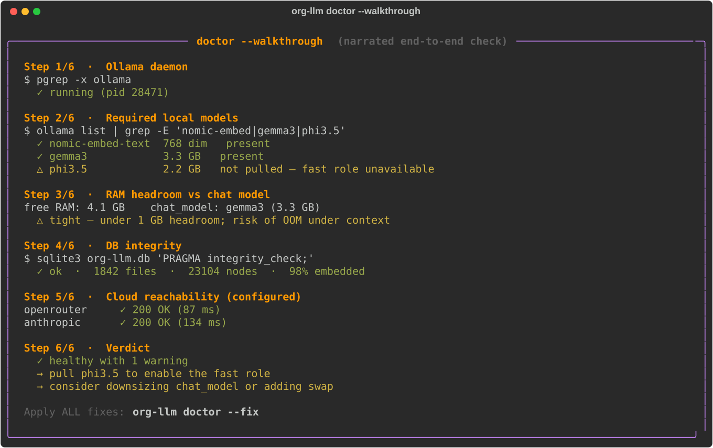</div>

### Power-boost — RAM-fit probe + cloud routing suggestion

`org-llm doctor power-boost` checks active model size vs free RAM
and proposes a downsize / upsize / cloud route in one screen. The
in-opencode LLM has the same probe via the `proactive_doctor` MCP
tool and is instructed to call it after 3+ non-converging tool calls.

<div align="center">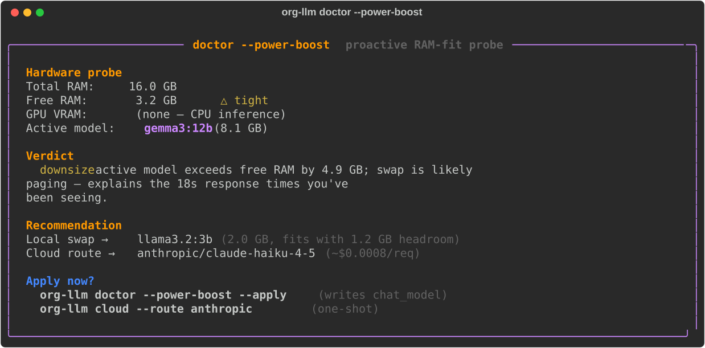</div>

---

## Life support — host telemetry + EMH

Self-hosting means the laptop is the substrate. When battery drops,
RAM tightens, thermals spike, or Ollama wedges, those are the failure
modes that turn this tool from helpful to frustrating. `life-support`
puts the eight vital systems on one screen.

```sh
org-llm life-support                    # single-shot probe + render
org-llm life-support --json             # scriptable snapshot
org-llm life-support --interval 5       # Rich Live polling panel (Ctrl-C exits)
org-llm life-support --analyze          # LLM optimisation advice
                                        # — with deterministic floor when
                                        #   <12 samples/probe OR all-nominal
```

Eight probes — `battery`, `cpu`, `memory`, `disk`, `thermal`,
`network`, `ollama`, `auto_embedder` — each emits a Trek-themed
status line and a normalized health score. Per-probe thresholds are
calibrated to the actual measurement (thermal reads against the
sensor's own reported critical temp, not a hardcoded curve; disk uses
% free not absolute GB; etc.).

<div align="center">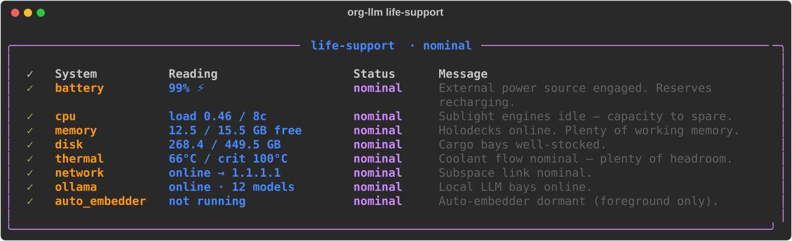</div>

Every reading writes one row to the `sensor_log` timeseries table
along with the user-activity context — *which org-llm verb / model
was running at probe time*. That's the highest-signal optimisation
lever: the LLM gets to say "CPU pegged WHILE `ask --reason` was
running" instead of "CPU is high."

### Sensors dashboard — drill-in

```sh
org-llm sensors                         # live LCARS overview
                                        # — sparklines across all 8 probes
org-llm sensors --drill cpu --window 30 # one-shot deep dive on a probe
```

The drill-in view shows current reading, min/mean/max over the window,
status histogram, and any activity-correlations recorded during
alert/critical readings.

<div align="center">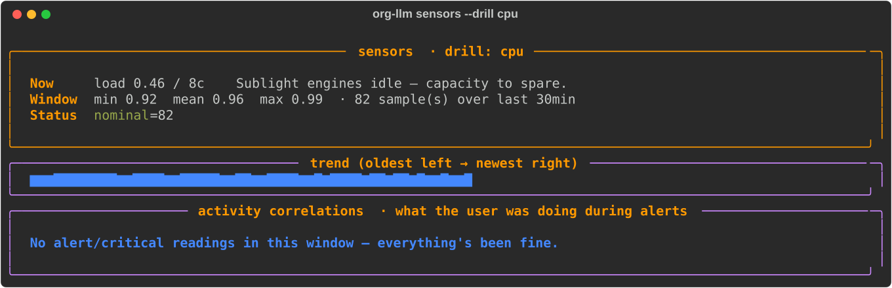</div>

### Dr. Crusher — doctor with live vitals

`org-llm doctor` now folds the same probe data into its diagnosis
flow. The Dr. Crusher persona reads the live readings + recent
activity correlations alongside the standard warnings, and the LLM
output echoes the overall vital-status verdict explicitly (so the
model can't claim "all nominal" when one probe is flagged).

<div align="center">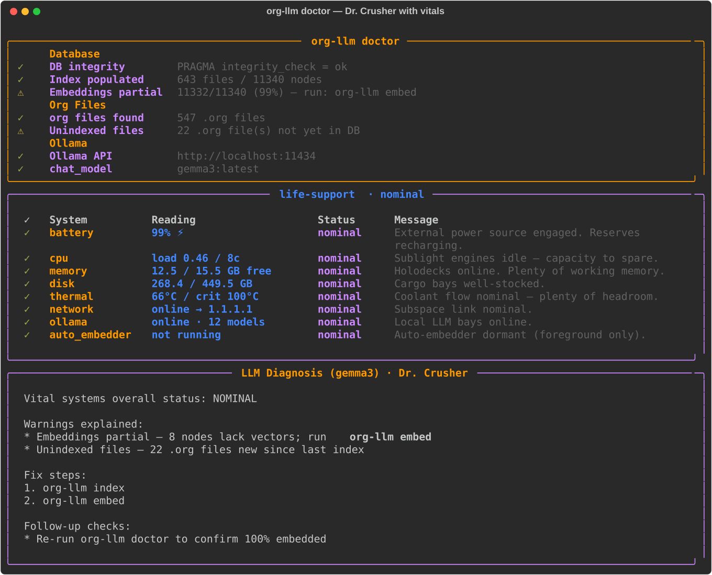</div>

### Emergency Medical Hologram — `ask --emh`

```sh
org-llm ask --emh "have I been thrashing the CPU?"          # question mode
org-llm ask --emh --diagnose "do a full health check"       # systematic
org-llm ask --emh --window-hours 168 "any patterns this week?"
```

The EMH answers historical questions grounded in `sensor_log`, not
the vault. Activates with the trademark "Please state the nature of
the medical emergency" panel, then rotating diagnostic readouts during
inference. Diagnose mode short-circuits to a deterministic
"examination complete" panel when every probe is nominal, sidestepping
the small-model failure mode where an LLM invents severities to fill
a priority list.

<div align="center">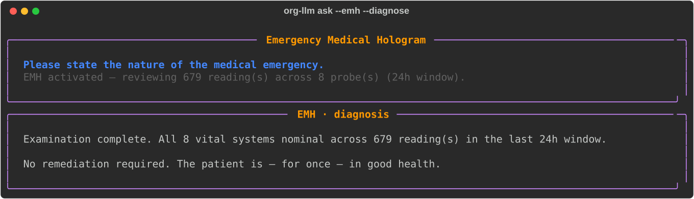</div>

### Why deterministic floors matter

Three guard rails got codified during the life-support build:

1. **Sample-size floor** — `--analyze` requires ≥12 readings per
   probe before calling the LLM. Below that, returns a flat status
   listing.
2. **All-nominal short-circuit** — when every probe is nominal AND
   nothing in the window tripped non-nominal, skip the LLM
   entirely. Small chat models hallucinate problems out of
   steady-state telemetry; this avoids the entire failure mode.
3. **No `normalized` exposure to the LLM** — the 0..1 health score
   is computed deterministically by each probe and never leaks into
   the prompt. The LLM sees status enums (`nominal` / `watch` /
   `alert` / `critical`) and human-unit values only. Removes the
   "0.97 norm-mean means 97% utilization" inversion class entirely.

All three apply to every LLM-using path in this feature:
`life-support --analyze`, Dr. Crusher's diagnosis, and `ask --emh`.

### MCP exposure

Four MCP tools mirror these surfaces for opencode (and any other MCP client like Claude Code):

| Tool | Purpose |
|---|---|
| `life_support_status` | 8-probe snapshot — same data as `life-support --json` |
| `life_support_history` | Pull rows from `sensor_log` (filterable by probe + window) |
| `life_support_advice` | LLM optimisation suggestions with the same deterministic floors |
| `emh_consult` | Voyager EMH persona — question + diagnose modes, configurable window |

Ask the LLM in opencode "what's my laptop's vital systems status?"
and it routes to `life_support_status`; ask "have I been thrashing
the CPU?" and it pulls from `life_support_history` or `emh_consult`.

---

## MCP file + browser grants

The MCP server exposes `read_file`, `list_directory`, `request_access`,
`open_url`, and `browser_command` to MCP clients (opencode, Claude
Code, …) — but only with your explicit authorization. Three layers:

```sh
# Direct grants:
org-llm grant ~/projects/work
org-llm grants                       # see everything currently authorised

# Auto-grant roots (LLM may self-extend within these via request_access):
org-llm grant-root ~

# Browser:
org-llm grant-browser
org-llm doctor install qutebrowser
```

Always-denied paths (sensitive deny-list, even with grants):
`~/.ssh`, `~/.gnupg`, `~/.password-store`, `~/.aws/credentials`,
`~/.kube/config`, `~/.netrc`, `/etc/shadow`, `/root/`, etc.

---

## Reports

```sh
org-llm report all     # everything below in one shot
org-llm report tags    # tag frequency leaderboard
org-llm report recent  # last 14 days of edits
org-llm report orphans # notes with no outgoing links
org-llm report daily   # daily/journal notes preview
```

<div align="center">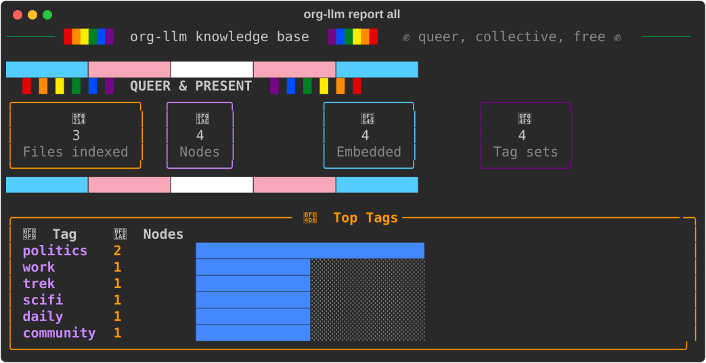</div>

---

## dbt analytics layer

org-llm ships a starter [dbt](https://docs.getdbt.com) project that
materializes analytics-ready views and tables in the *same* SQLite file
the indexer writes. The whole layer is wrapped by `org-llm dbt …` so
you don't leave the org-llm CLI to run, test, or maintain it. `setup`
auto-runs `dbt init` + `dbt build` (Step 9.5), so a fresh user has
working analytics views immediately after indexing.

```sh
org-llm dbt init      # copy bundled templates → ~/.local/share/org-llm/dbt/
org-llm dbt build     # run + test in dependency order (the canonical step)
org-llm dbt status    # row counts per model in your DB
org-llm dbt doctor    # binary, project, DB, raw tables, compile-clean
org-llm dbt models    # list with materialization
org-llm dbt run -s staging        # only the staging views
org-llm dbt run -s recent_nodes   # one specific model
```

What's in the box:

- `stg_nodes` (view) — clean nodes with file_path, relative_path,
  modified_at, an `has_embedding` flag, and **both** tag buckets
  (file source-of-truth + LLM `auto_tags`).
- `stg_files` (view) — files with `days_since_modified`.
- `nodes_by_tag` (table) — merged tag → node count + titles.
- `recent_nodes` (table) — modified in last 30 days.
- `orphan_nodes` (table) — has an ID, no incoming links.
- `daily_notes` (table) — files under `/daily/`.

Where it lives:

| Location | Purpose |
|---|---|
| `org_llm/dbt_templates/` | Read-only bundled starter (in the package) |
| `~/.local/share/org-llm/dbt/` | Your editable copy after `dbt init` |
| `$ORG_LLM_DBT_DIR` | Override either default |

**Inside opencode:** the `launch` workspace exposes 7 dbt MCP tools
(`dbt_status`, `dbt_doctor`, `dbt_models`, `dbt_run`, `dbt_test`,
`dbt_build`, `dbt_compile`) and 7 slash commands (`/dbt-status`,
`/dbt-doctor`, `/dbt-models`, `/dbt-build`, `/dbt-run`, `/dbt-test`,
`/dbt-compile`). The in-opencode LLM can run analytics over your vault
without you typing a single dbt command.

<div align="center"></div>

---

## Emacs config review

Auto-detects your Doom or vanilla config and asks `reason_model` for structured
advice — strengths, issues, prioritized improvements, optional polish.

```sh
org-llm review-emacs                       # full review
org-llm review-emacs --focus performance   # narrow scope
org-llm review-emacs --diff-only -o p.md   # emit patch hunks
```

<div align="center">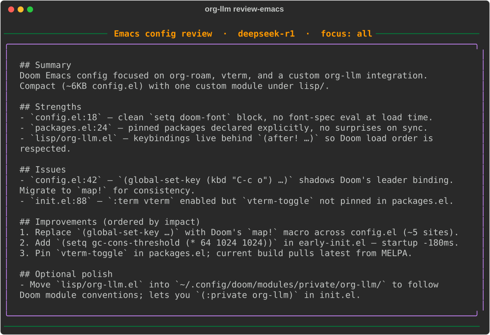</div>

Past reviews are written to the `history` table so you can find them later
with `org-llm db -q "SELECT timestamp, query FROM history WHERE command='review-emacs'"`.

---

## Theme knobs (pluggable registry)

`trek` / `commie` / `queer` are built-in dials (0–3) that shape every
themed surface across the app — completion messages, splash subtitle,
panel titles, opencode greetings, MCP tool decorations. Levels are
weights, not booleans:

```
0 = silent  |  1 = sparse (½×)  |  2 = normal  |  3 = max (2×)
```

**Pluggable, not hardcoded.** Every knob — including the built-ins —
is a `KnobDef` (name, description, cumulative `keywords_by_level`)
loaded from `org_llm/knobs.py:BUILTIN_KNOBS` and merged with the
SQLite `theme_knobs` config row. Adding a new dial is a config
change, not a code change. Levels are cumulative: dialing trek to 3
adds level-3 keywords on top of levels 1+2, so higher dial = MORE
flavour available, not different.

Persist + dial:

```sh
org-llm config queer_level 1     # half pride
org-llm config commie_level 3    # 2× solidarity
org-llm config trek_level 0      # silence Trek
```

Or per-command via `ORG_LLM_<NAME>_LEVEL`.

### Define your own dial

```sh
org-llm knob add dinosaur \
  -m '◀ ROAR.|info' \
  -m '◀ Dino-mite work, comrade.|lcars1'

org-llm config dinosaur_level 2
org-llm knob list
```

User knobs participate **automatically** in the LLM-driven theming
quality gate (see below) — once they have a `keywords_by_level` block
in the registry, any LLM-themed surface enforces them.

<div align="center">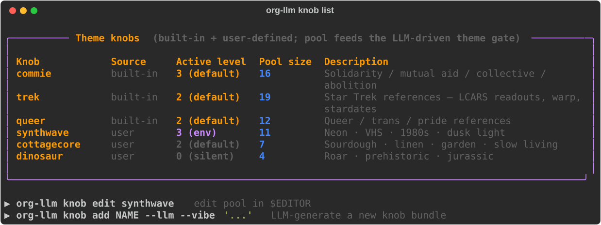</div>

### LCARS palette picker

Five named LCARS palettes ship — switchable with one command, no
rebuild. Per-channel hex overrides via `--primary` / `--secondary` /
`--tertiary`.

```sh
org-llm palette                            # text-based picker
org-llm palette red                        # red-alert mode
org-llm palette green                      # Voyager astrometrics
org-llm palette gold --primary '#FFD60A'   # named + per-channel override
org-llm palette reset                      # back to classic
```

<div align="center">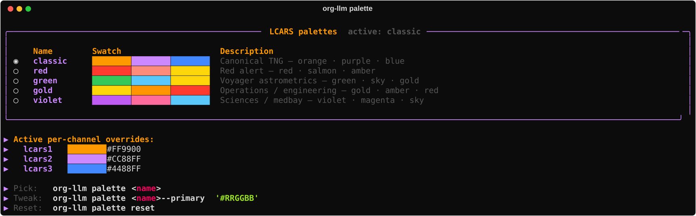</div>

---

## LLM-driven theming + quality gate

Knobs don't just shape the message pool — the active dials drive
**every** themed surface in the app. The pipeline:

1. **Surface registry** (`org_llm/theme_studio.py:SURFACES`) — every
   themable UI slot (splash subtitle, splash slogan, panel titles,
   doctor-all-green line, opencode greeting + persona intro, MCP
   tool success/error suffixes, ask-retrieving spinner) declared
   with length bounds + a default + a one-line LLM-facing description.
2. **Generation** — `theme-studio regenerate` calls the LLM (fast_model,
   escalating to chat_model on poor yield) once per surface with the
   active dials and registry-sourced descriptions; expects N candidates.
3. **Quality gate** — every candidate runs through `gate()`: length
   bounds, forbidden phrases (system-prompt leaks, "as an AI", markdown
   headers, prompt-escape sequences), well-formed Rich markup, AND must
   contain at least one keyword from the cumulative pool of every
   dialed-up knob.
4. **Cache** — survivors written to `~/.local/share/org-llm/theme-cache.json`
   keyed by dial signature. Surfaces read via `get_themed(key, default=…)`
   — cold cache transparently returns the hardcoded default, so render
   never blocks on generation.

```sh
org-llm theme-studio regenerate          # warm the cache for active dials
org-llm theme-studio regenerate -o splash_subtitle,splash_slogan  # subset
org-llm theme-studio verify              # re-run gate, report pass/fail per variant
org-llm theme-studio show                # list every surface + active value
org-llm theme-studio show splash_subtitle
```

<div align="center">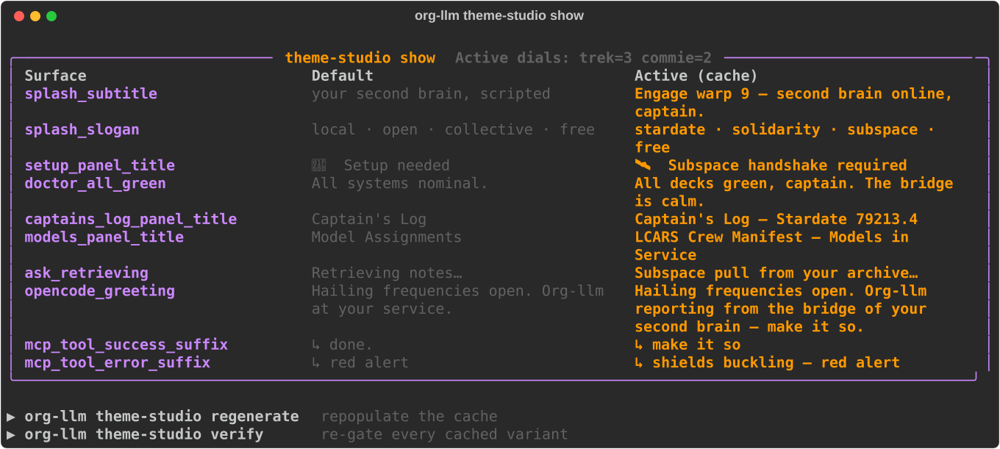</div>

The gate is the trust boundary — if it accepts garbage, you render
garbage; if it rejects everything good, you never theme. `verify`
prints a per-variant pass/fail report so you can see what the LLM is
actually producing, and what's getting rejected and why:

<div align="center">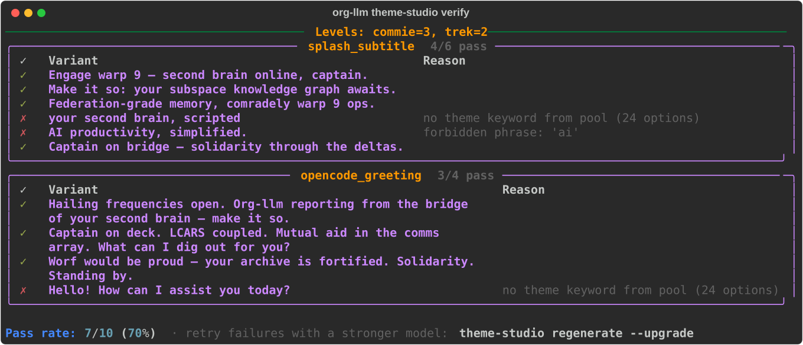</div>

The pluggability test in `tests/test_theme_studio.py` proves a
user-defined knob with its own keyword pool participates without any
code change.

---

## Auto-personalize: themes from your content

`org-llm personalize` is **LLM-driven theme synthesis**, not string
matching. It feeds your actual recent note titles, body excerpts, top
tags, and project READMEs to a local model and asks it to propose
**evocative theme names** — the kind you'd see on a moodboard.

```sh
org-llm personalize                 # dry-run preview (LLM-driven)
org-llm personalize --apply         # register the proposed knobs
org-llm personalize -a --no-llm     # apply with deterministic fallback
org-llm personalize -a --overwrite  # replace existing user knobs
```

Real output from a working data-engineer's vault:

```
Knob        Source            Level  Sample message
brainwave   llm-synthesized       2  ◀ Neural pathways aligned, response generated.
workbench   llm-synthesized       2  ◀ Chisel marks on worn wood welcome hands.
laboratory  llm-synthesized       2  ◀ Pipette tips aligned, liquid drawn.
schema      llm-synthesized       2  ◀ Primary keys aligned. Structure is now in place.
workshop    llm-synthesized       2  ◀ Workbench cleared, steel scraps aligned.
```

The themes match the actual *vibe* of the content — not literal project
names like `bh-gh-spcs` or exam codes like
`tableau_associate_architect_partner_exam`. An identifier-shape filter
(snake_case, multi-segment hyphens, digits, length>20) keeps those out
of the LLM's input entirely. Each theme's completion messages reference
**concrete imagery from that world**, not the theme name as a noun.

How it works:

- **Evidence gathering** is deterministic: scan `Node.tags` for non-boring
  non-identifier tags (≥2 occurrences), pull recent titles + 240-char
  body excerpts (last 60 nodes), walk repos-roots from `discover()` for
  README first paragraphs, infer the preferred language.
- **Theme synthesis** sends that evidence to the local model
  (preferring `llama3.2:1b` for speed) with a strict prompt: "evocative
  theme names — synthwave / homelab / espresso, NOT project names or
  exam codes". Returns JSON with `name`, `reason`, `imagery`. 90s
  thread-timeout so a slow model can't hang the user.
- **Message generation** runs once per theme: same model, prompt
  includes the imagery the synthesizer named, asks for 6 messages
  with concrete sensory details (8-15 words, ≤1 metaphor per line).
- **Deterministic fallback** (`--no-llm` or LLM unreachable) is
  intentionally minimal — picks ONLY single-word non-identifier tags
  with ≥5 occurrences. Better to propose nothing than dumb things.
- **Each proposal becomes a knob**: a name, default level (1–2),
  styled messages spread across LCARS / pride colours. The LLM in
  opencode sees these knobs in its system prompt and is asked to
  match the energy.

Inspect with `org-llm knob list`; tune levels with
`org-llm config <name>_level 0..3` or `ORG_LLM_<NAME>_LEVEL=0..3`.

---

## Context, history, and stale-tagging

> Background reading: [Staleness](docs/wiki/staleness.org) in the wiki —
> file-vs-disk drift AND content-vs-current-truth drift; how org-llm
> flows both.

The vault records what was true *when written*. Without overrides, the
LLM keeps citing stale facts. Three tangle-driven files solve this:

| File | Role | Tangles to |
|---|---|---|
| `~/org/llm-context.org` | Current truth — overrides stale info | `~/.local/share/org-llm/llm-context.txt` |
| `~/org/llm-history.org` | LLM-generated narrative of older / archived notes | `~/.local/share/org-llm/llm-history.txt` |
| Existing notes | Some get tagged `:stale:` over time | (in the SQLite index) |

Both `*.org` files are normal org files — human-editable, version-
controllable, with literate `#+begin_src ... :tangle <path> ... #+end_src`
blocks. The tangled plain-text outputs get prepended to every system
prompt as `USER CONTEXT` and `HISTORICAL CONTEXT` headers.

**Recording current truth:**

```sh
# Direct one-liner
org-llm context add 'Works at Idexx since 2026-04 (formerly Unum).' \
                    --topic employment

# LLM-parsed freeform → structured
org-llm context from-prompt \
  "I no longer work at Unum, now at Idexx as of April 2026."
```

Both flows offer to scan the vault for nodes mentioning superseded
keywords and tag them `:stale: :re:employment:` so retrieval reweights.

**Inside opencode**, the LLM calls `add_context()` itself — say "I no
longer work at X, now Y" and it'll register the fact + propose stale
tags.

**LLM-driven staleness sweep:**

```sh
org-llm stale                   # LLM judges 20 oldest non-stale nodes
org-llm stale --apply           # skip confirm; auto-tag
org-llm stale --limit 50 --since-days 365
```

For each node the LLM emits `stale` (contradicts current truth),
`drift` (framing assumes older facts), or `fresh` (skipped). Doctor
flags unreviewed candidates so this stays on your radar.

**History narrative** — stale ≠ worthless:

```sh
org-llm history build              # scans stale-tagged + 180+ day notes
org-llm history build --interactive # 3-question interview first
org-llm history show               # what's prepended as HISTORICAL CONTEXT
```

The build scans:
- All nodes tagged `:stale:` (any age)
- Plus all non-code nodes older than `--age-days` (default 180)
- **Plus the archive walk** — `~/org/archive/**/*.org`,
  `~/org/**/archive/**/*.org`, `*.org_archive`. Those usually aren't
  indexed but they're prime narrative material.

The LLM organises bullets under appropriate headings (Employment,
Project, Address, Relationship history) and writes them into
`~/org/llm-history.org`'s tangle block.

**System-prompt injection.** Every `ask`, `code`, `review-emacs`,
`launch` prepends both files (when present) so the LLM always has
current truth + temporal background before deciding what to cite.

**The tangle parser** is a tight ~30-line subset of `org-babel-tangle`
in `org_llm.context`. Handles `:tangle PATH`, `:tangle no`, default
target, tilde expansion, multiple blocks per target, indented bodies,
header args interleaved. No `emacsclient` required. 11 unit tests
cover the edge cases.

---

## Self-modification + rollback

`org-llm self` lets you read and revise the running app's own Python
source and config DB, with safe rollback via an artifact bundle (a
tarball plus a standalone bash script that runs without Python).

```sh
# Read
org-llm self show cli              # print module source
org-llm self edit context          # open in $EDITOR

# Snapshot before risky changes
org-llm self snapshot -l "before-refactor"
# → ~/.local/share/org-llm/snapshots/<ts>/
# → ~/.local/share/org-llm/snapshots/<ts>.tar.gz
# → also appended to ~/org/org-llm-self-mod.org

org-llm self snapshots             # list with metadata table

# LLM-driven revisions (always snapshots first)
org-llm self llm-revise cli "make the doctor command emit JSON when --json is set"
# → LLM proposes a JSON patch (replace ops); preview shown
# → user confirms; ops applied with uniqueness checks

# Roll back if anything breaks
org-llm self rollback              # newest snapshot
org-llm self rollback before-refactor   # by label
org-llm self rollback 20260426-15  # by id prefix
# → pre-rollback backup written to /tmp/org-llm-pre-rollback-<ts>/

org-llm self log                   # print the org-mode self-mod log
```

**The rollback script is standalone bash.** Even when the in-process
app is broken, you can `bash ~/.local/share/org-llm/snapshots/<ts>/rollback.sh`
from any shell — no Python needed. It does its own pre-rollback
backup into `/tmp/` so you can un-rollback.

<div align="center">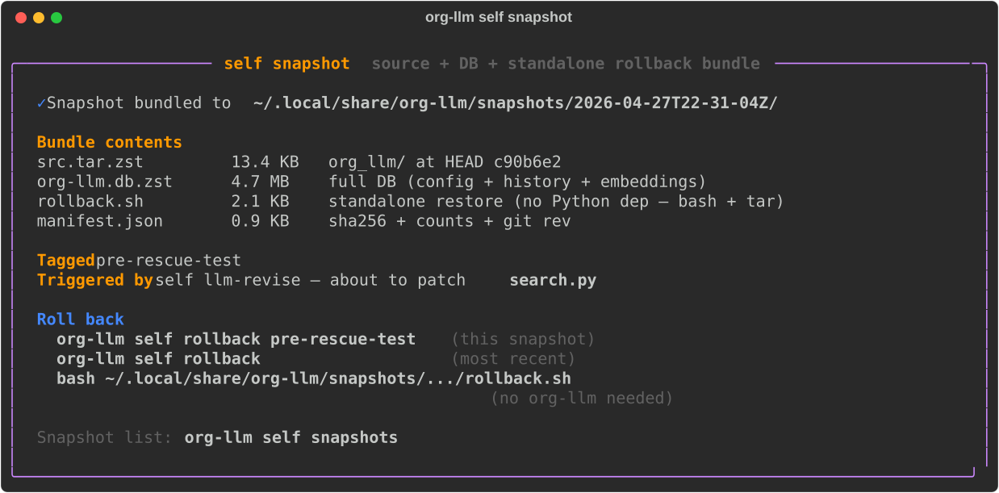</div>

**Safety guarantees on `llm-revise`:**

- ALWAYS takes a pre-revise snapshot first (override with `--no-snapshot`,
  not recommended).
- Each `replace` op's `old` block must match **exactly once** in the
  file. 0 matches → "LLM hallucinated"; >1 matches → "ambiguous;
  silent multi-replace = surprise"; both refuse to apply.
- The system prompt explicitly refuses changes that bypass security
  boundaries (deny-list, traversal, credential exfil, eval-arbitrary-input).

**Org-mode activity log.** Every `self snapshot / rollback / llm-revise
/ edit` appends to `~/org/org-llm-self-mod.org` with structured
properties (`:SELFMOD_KIND:`, `:SNAPSHOT_ID:`, `:GIT_HASH:`) and the
rollback shell script captured as a `:tangle` block. So you can
`org-llm ask "what have I changed about org-llm lately?"` and read it
as plain text — and tangle out a stand-alone recovery script per
log entry if needed.

---

## Themed spinners — your knobs animate the wait

Every LLM call shows a spinner via the new `thinking()` context manager.
The spinner's animation and colour are picked per-call from the user's
**currently-active theme knobs and dials**, so LLM waits visually
reflect the same vibe as the completion-message pool.

How it picks:

1. Reads built-in dials (`trek` / `commie` / `queer`) — env-var or DB
   level > 0 adds that dial to the candidate pool, weighted by level.
2. Reads user-defined knobs from the `user_theme_knobs` config row.
   Each active knob name is fuzzy-matched (longest-substring wins)
   against a 50-entry spinner catalogue (`SPINNER_CATALOG` in
   `org_llm.ui`) — `synthwave` → `dots12` in violet, `homelab` →
   `bouncingBar` in blue, `laboratory` → `dots3` in green, etc.
3. If multiple knobs are active, picks one randomly per call —
   different LLM waits in the same session show different spinners.
4. **Default fallback (no active knobs)** is a Doom-Emacs-aligned
   smooth purple `dots11`.

```sh
# Silence everything → Doom-default purple dots
ORG_LLM_TREK_LEVEL=0 ORG_LLM_COMMIE_LEVEL=0 ORG_LLM_QUEER_LEVEL=0 \
  org-llm ask 'x'

# Cyberpunk vibes → aesthetic + violet
ORG_LLM_QUEER_LEVEL=3 org-llm ask 'x'

# After `personalize --apply` registered a synthwave knob:
ORG_LLM_SYNTHWAVE_LEVEL=3 org-llm ask 'x'   # neon dots12 violet
```

The same `thinking()` context manager wraps every user-facing LLM call
in the app: chat answers, code generation, capture polishing, doctor
diagnosis, theme synthesis, message generation, intent repair. So you
see a themed spinner everywhere there's a wait.

`warp()` (the original LCARS arc-spinner) is still used for non-LLM
blocking I/O — indexing, embedding, file walks. The visual difference
lets you tell at a glance whether the wait is local work or a model
generating tokens.

---

## LLM copywriting throughout

Most user-facing prompts that used to be string templates now go
through `_llm_one_liner()` — feeding real state to a small fast model
and asking for a single concrete line of copy. The result varies
across runs, references your actual content, and falls back to
deterministic templates only when the LLM is unreachable.

| Command | What the LLM writes for you (with real-state grounding) |
|---|---|
| `org-llm init` | next-step nudge, counts of real `.org` files in `org_dir` |
| `org-llm index` / `embed` | a fitting follow-up question generated from your top tags + recent titles |
| `org-llm capture` | a follow-up `ask` line about the freshly-saved note's neighbours |
| `org-llm tag --apply` | Try-it line anchored to the just-tagged set |
| `org-llm code index` | per-file question generated from extracted symbols (`def`/`class`/`defun`/`fn`/`pub fn`/...) |
| `org-llm models` | "Next: <plain reason> — `org-llm <command>`" picked by the LLM from current role/pulled state |
| `org-llm doctor` | closing line summarises the worst real finding into one actionable sentence |
| `org-llm ask` zero-results | 2-3 alternative queries from top tags + recent titles instead of empty exit |
| `org-llm code` | system prompt carries detected language + last-touched code files |
| `org-llm review-emacs` | closes with one extra LLM call → "single most impactful change" |
| `org-llm tutor welcome` | recommends the *next* tutor step for your vault's actual state (empty / indexed / embedded / searchable) |
| `org-llm launch` | system prompt has TODAY OPENING PROMPT generated from last 7 days, plus top tags, models, hardware, project READMEs, knobs/dials |
| `org-llm personalize` | full LLM theme synthesis from real titles + body excerpts + READMEs (see [previous section](#auto-personalize-themes-from-your-content)) |

`ask` also expands retrieval with a project's README when the query
mentions a real repo under your code roots — so "what does bh-gh-spcs
do?" reads `~/repos/bh-gh-spcs/README.md` even if no notes match.

The shell-paste-safety rule applies everywhere: every Try-it line is
single-quoted with apostrophes stripped from interpolated content,
so pasted commands round-trip cleanly through any shell.

---

## Theme: dark + light

Default is **dark** (LCARS-canonical bright orange/purple/blue on a dark
terminal). Switch persistently with `org-llm theme light`, or per-command with
`ORG_LLM_THEME=light org-llm …`. Every colour the app emits — Rich console,
banners, panels, progress bars, plus the `bat`/`delta`/`starship`/`fzf` theme
files written by `doctor install` — switches in lockstep.

<table>
<tr>
  <th align="center">Dark mode (default)</th>
  <th align="center">Light mode</th>
</tr>
<tr>
  <td></td>
  <td>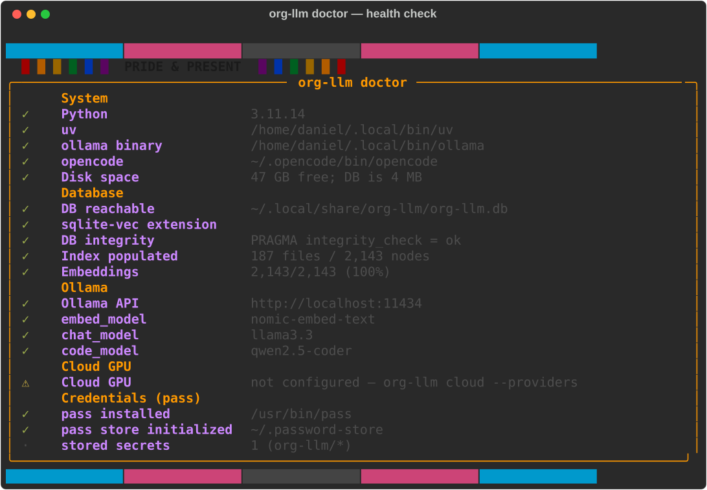</td>
</tr>
<tr>
  <td></td>
  <td></td>
</tr>
<tr>
  <td></td>
  <td>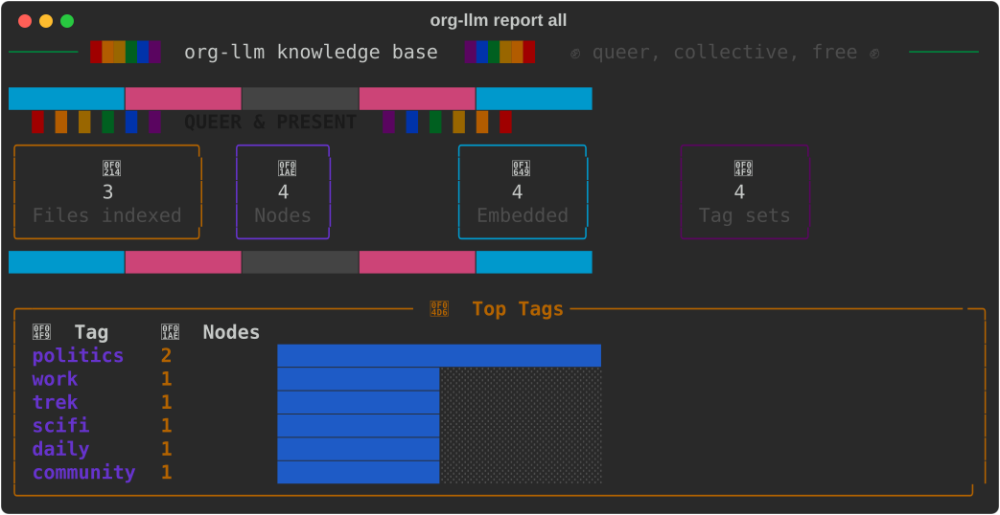</td>
</tr>
<tr>
  <td>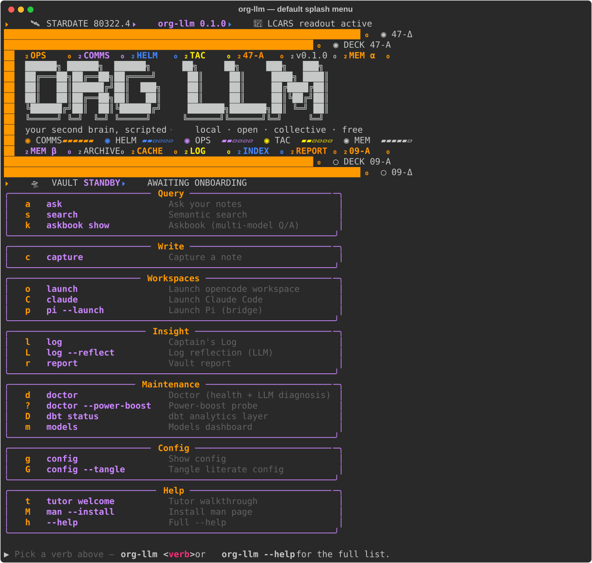</td>
  <td>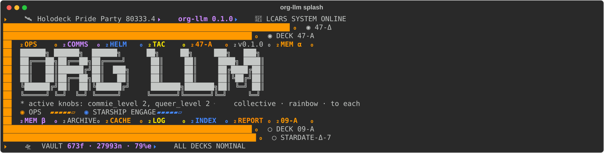</td>
</tr>
<tr>
  <td>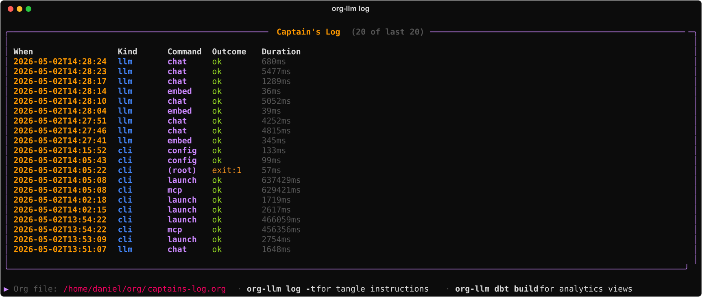</td>
  <td>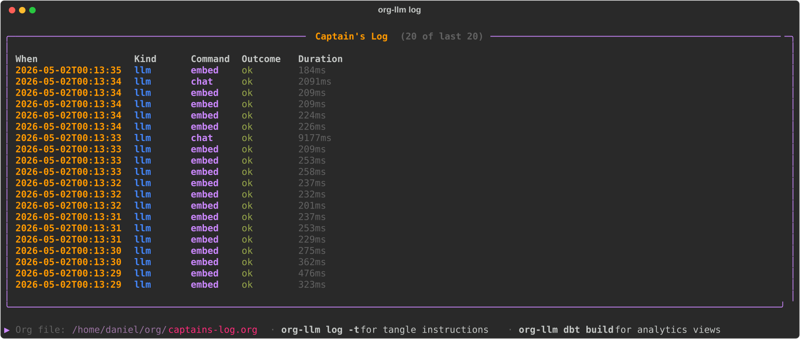</td>
</tr>
<tr>
  <td></td>
  <td>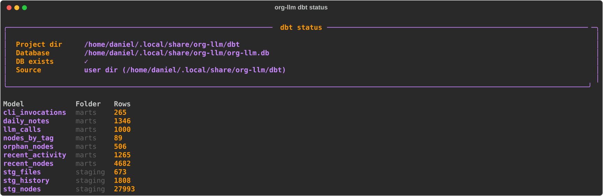</td>
</tr>
</table>

```sh
org-llm theme show     # show stored + active mode
org-llm theme light    # persist as light
org-llm theme dark
org-llm theme toggle   # flip whatever is set
```

---

## Environment variables

| Variable | Effect |
|---|---|
| `ORG_LLM_DB` | Override the SQLite database path (default: `~/.local/share/org-llm/org-llm.db`) |
| `ORG_LLM_ORG_DIR` | Override the org-roam directory (default: `org_dir` config key, fallback `~/org`) |
| `ORG_LLM_OLLAMA_URL` | Override the Ollama endpoint (default: `ollama_url` config key, fallback `http://localhost:11434`) |
| `ORG_LLM_THEME` | `dark` or `light` (default: `dark`). Persistent: `org-llm theme {dark,light,toggle}`. |
| `ORG_LLM_NERD_FONTS` | Force-enable (`1`/`yes`) or disable (`0`/`no`) Nerd Font icons |
| `ORG_LLM_TREK_LEVEL` | Star Trek messaging weight, `0` (silent) / `1` (½×) / `2` (1×) / `3` (2×). Default `2`. Persistent via `org-llm config trek_level N`. |
| `ORG_LLM_COMMIE_LEVEL` | Solidarity messaging weight, `0`–`3`. Persistent via `config commie_level N`. |
| `ORG_LLM_QUEER_LEVEL` | Pride/trans messaging weight, `0`–`3`. Persistent via `config queer_level N`. |
| `ORG_LLM_<KNOB>_LEVEL` | Any user-defined knob from `org-llm knob add`, `0`–`3`. Persistent via `config <name>_level N`. |
| `PASSWORD_STORE_DIR` | Override the `pass` store location (default: `~/.password-store`) |
| `ANTHROPIC_API_KEY` | Used by `org-llm claude`. If unset, falls back to `pass` slug `org-llm/anthropic/api-key`. |

Resolution order is always: **env var → SQLite config → built-in default**, so
you can override any setting for a single command without touching the DB.

---

## Tutor

```sh
org-llm tutor          # show the welcome step
org-llm tutor <step>   # jump to one of the 24 steps
org-llm tutor --all    # read everything start-to-finish
```

<div align="center">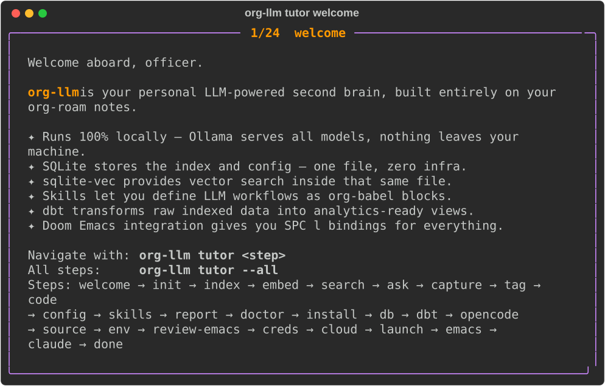</div>

Steps:
`welcome → init → index → embed → search → ask → capture → tag → code →
config → skills → report → doctor → install → db → dbt → opencode →
source → review-emacs → creds → cloud → launch → emacs → claude → done`

---

## Recording GIFs (optional)

The static SVGs above are generated by `tools/gallery.py` (run from the repo
root with `uv run python tools/gallery.py`). For animated demos, install
[`vhs`](https://github.com/charmbracelet/vhs) plus its dependency `ttyd`:

```sh
# vhs binary
curl -sL https://github.com/charmbracelet/vhs/releases/latest/download/vhs_Linux_x86_64.tar.gz \
  | tar xz -C /tmp && mv /tmp/vhs_*_Linux_x86_64/vhs ~/.local/bin/

# ttyd (ubuntu/debian)
sudo apt install ttyd
```

Then write a `.tape` script under `docs/tape/` and run `vhs <script>.tape`.

---

## Development

```sh
git clone git@github.com:daniel2501/org-llm.git
cd org-llm
uv sync                 # install deps + dev tools
uv run pytest -q        # run the test suite (660+ tests)
uv run python tools/gallery.py   # regenerate README screenshots
```

The Python source is **tangled from the org file** at
`~/org/20260425230731-org_llm.org`. Edit there, `, b t` (`org-babel-tangle`),
commit both repos.

Project layout:

```
org_llm/
  cli.py          # the Typer app — every CLI command (incl. `setup`)
  cli_skills.py   # skill / skills / skill-index / skill-new commands
  cloud.py        # multi-provider GPU registry + chat/embed/check
  code_index.py   # cross-corpus indexer for ~/repos
  context.py      # tangle-driven USER + HISTORICAL context, stale sweep
  creds.py        # `pass` wrapper for API keys
  db.py           # SQLAlchemy models + sqlite-vec extension load
  discover.py     # filesystem probe (org_dir / repos / dotfiles)
  fixer_bench.py  # benchmark cloud LLMs on canonical fix scenarios
  indexer.py      # parse org → files/nodes
  llm.py          # thin Ollama wrapper
  mcp_server.py   # FastMCP server with 49 tools
  models.py       # FOSS model catalog + tool registry + theming
  performance.py  # hardware-aware tuner (free RAM, measured tok/s)
  personalize.py  # LLM-driven theme synthesis from real content
  access.py       # MCP file/browser grants + sensitive-path deny-list
  report.py       # rich text reports
  search.py       # signal-boosted vector + keyword search
  skills.py       # :skill: org-babel block extractor + runner
  ui.py           # console, themes, banners, themed spinners
tests/            # 660+ tests across 19 test files
org_llm/dbt_templates/  # bundled dbt starter project (copied to user-space on `dbt init`)
doom/             # Doom Emacs integration (org-llm.el)
tools/            # gallery.py screenshot generator
```

---

## Captain's Log

Every notable event — CLI invocation, LLM round-trip, MCP tool call,
config change, doctor verdict — is mirrored to **two surfaces** that
stay in lockstep:

- the SQLite `history` table (queryable, joinable, dbt-friendly)
- `~/org/captains-log.org` — themed, with a `:tangle` block per
  high-volume kind so plaintext mirrors land at
  `~/.local/share/org-llm/log/<kind>.log` after `org-babel-tangle`.

```sh
org-llm log                       # recent entries (themed table)
org-llm log --kind llm            # filter to LLM round-trips
org-llm log --grep PATTERN        # substring search
org-llm log --reflect             # LLM reflects: PATTERNS / SUGGESTIONS / HEADLINE
org-llm log --tangle              # emacsclient instructions for tangling
org-llm log --kind llm --export ~/org/journal.org    # append filtered rows to any org file
```

Auto-reflect every Nth invocation (default 50, 0 to disable) prints a
one-line headline at the end of routine commands so patterns surface
without your asking.

dbt models on top of the log: `stg_history` view, `llm_calls`,
`cli_invocations`, `recent_activity` marts. `org-llm dbt build` after
heavy use to query your own usage like data.

<div align="center"></div>

---

## Background auto-embedder

Opt-in daemon thread that polls your vault every ~60s, runs
incremental `index_directory` + `embed_nodes` when files change, and
records every batch to Captain's Log. Manual `org-llm embed` keeps
working unchanged — this just means you don't have to remember.

```sh
org-llm config auto_embed_enabled true   # opt in (or pick during setup)
org-llm watch                            # foreground watcher
org-llm watch --daemon                   # systemd / tmux / nohup hints
```

When the watcher has reported in within 5 minutes, every other CLI
command's footer briefly shows its status (e.g.
`· auto-embed 12s ago: +3f +5n +5e`). Silent when idle.

---

## Askbook — multi-model Q/A as an org file

`~/org/org-llm-askbook.org` is a literate Q/A scratchpad. Each entry
is a `:PROPERTIES:` block with `QUESTION` / `BACKEND` / `MODEL` /
`STATUS`, followed by an empty answer body. `askbook run` fills in
all `pending` entries using the named backend.

```sh
org-llm askbook add 'Why is sqlite-vec so fast?' --backend cloud
org-llm askbook add 'Why is sqlite-vec so fast?' --backend chat
org-llm askbook run                       # answer all pending
org-llm askbook list                      # show entries + status
org-llm askbook export ~/org/q-log.org    # copy to other org file
```

Backends: `chat reason fast code text cloud claude pi`. Same
question across multiple backends sits side-by-side in plain org —
diffable, taggable, indexable into the same vault you ask about.

<div align="center">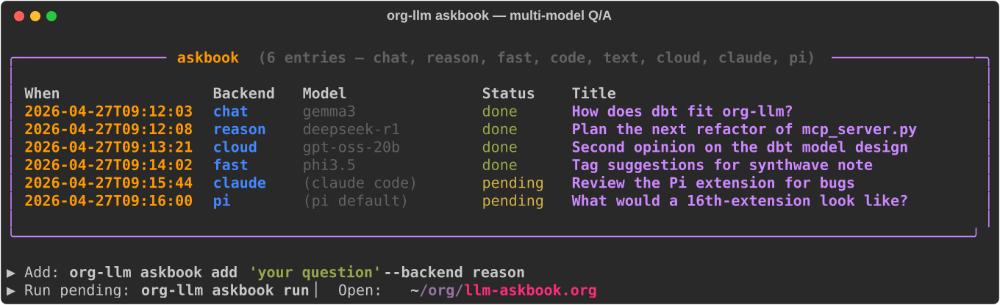</div>

---

## Literate config — DB ↔ org-file round-trip

`org-llm config --tangle` writes `~/org/org-llm-config.org` shaped
like context.org / llm-history.org / captains-log.org: one heading
per key with a PROPERTIES drawer + a `#+begin_src text :tangle …`
block whose content IS the value. Edit message bodies in place,
`--apply-from-org` to push back.

```sh
org-llm config --tangle                          # write the org file
org-llm config --apply-from-org                  # apply edits back to DB
org-llm config --diff-org                        # preview pending changes
org-llm config --search PATTERN                  # fuzzy-find key + description
org-llm config --tangle --keys 'doctor_*' \      # selective: just doctor knobs
              --to ~/org/doctor-config.org
```

Theme knobs round-trip too — every user-defined knob renders a
`** Knob: NAME` heading with `*** msg N [style]` subheadings so you
can edit message bodies in org. `org-llm knob add NAME --llm
--vibe '...' --specifics font=X color=Y` LLM-generates a themed
message bundle from a free-form vibe + a small specifics dict.

Auto-sync (`config_org_autosync=true`) re-tangles after every CLI /
MCP set so the file stays fresh; off by default.

<div align="center">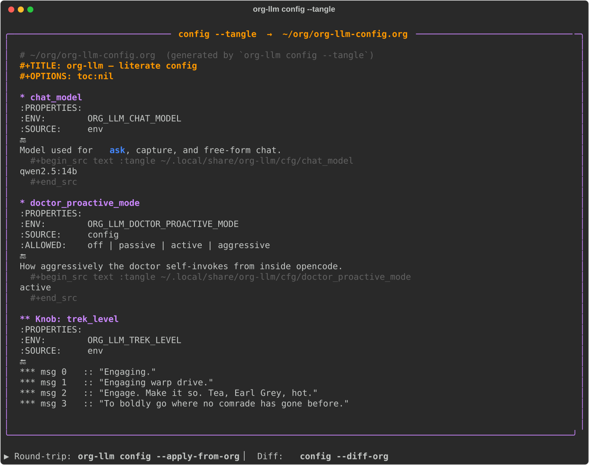</div>

---

## LLM rescue + self-rewrite

When any uncaught exception bubbles out of a command body, `main()`
catches it, hands the type/message/traceback-tail to the configured
chat model, and renders a strict-format diagnosis:

```
WHY: <root cause in one sentence>
FIX: <one shell command, or 'manual:' step>
WHY-IT-WORKS: <one-sentence justification>
```

If the offending frame is in org-llm itself, you're offered an
opt-in self-rewrite: snapshot first (the same `self_mod` machinery
that powers `org-llm self snapshot/rollback`), LLM proposes a JSON
patch, you review the summary, apply, then auto-test by re-running
the failing command. If it still fails, **automatic rollback** —
you're always returned to a known-good state.

For slow / stuck sessions, `org-llm doctor power-boost` probes
chat_model fit vs available RAM and proposes a downsize/upsize/cloud
switch. The in-opencode LLM has the same probe via `proactive_doctor`
and is instructed (per the system prompt) to call it after 3+
non-converging tool calls.

<div align="center">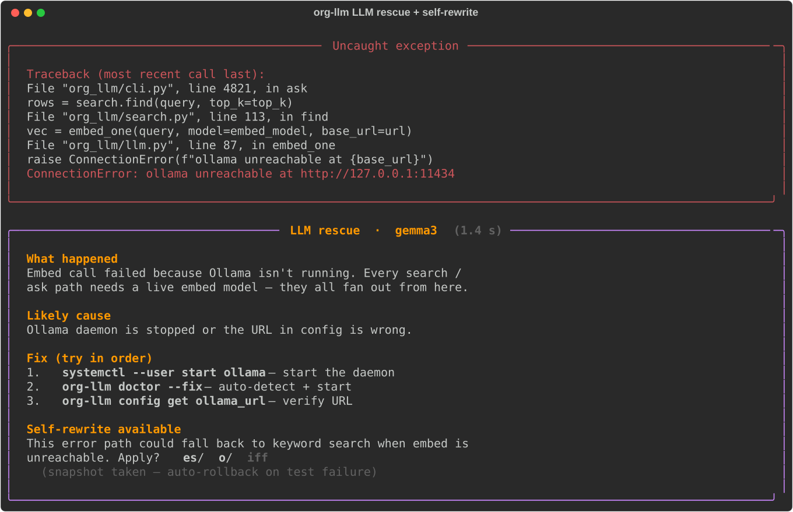</div>

---

## Models dashboard

`org-llm models` (no flags) is a single-screen view: every role
with current model, fits-in-RAM, pulled status, and an automatic
**Suggestions** panel running the same `recommendations()` as
`--tune`. Tweak in one shot:

```sh
org-llm models --set chat=gemma3       # one-shot assignment
org-llm models --pull <tag>            # pull via Ollama
org-llm models --tune --apply          # apply ALL suggestions
```

<div align="center">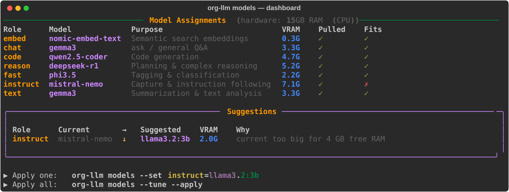</div>

---

## Man page

`org-llm man --install` writes `~/.local/share/man/man1/org-llm.1`
derived live from the Typer registry — same source `--help` reads
from, so the man page stays in parity without a build step.

```sh
org-llm man --install     # write + print MANPATH hint if needed
org-llm man               # install (idempotent) + open in `man`
org-llm man --show        # render to stdout
org-llm man --output PATH # write to a custom location
```

When the install dir isn't on `manpath`, the install hint includes
the right shell rc snippet for your `$SHELL` (bash / zsh / fish).

---

## Common gotchas

If something doesn't behave the way you expect, this is the short list:

- **Search / ask retrieval feels off after upgrading.** As of
  2026-04-29, `org-llm` embeds with the nomic-embed-text task-instruction
  prefixes (`search_query:` / `search_document:`) the model card
  requires. Older vaults were embedded without those prefixes — search
  still works but quality is lower. **One-time migration:**
  ```sh
  org-llm embed --force
  ```
  Re-embeds the whole vault under the prefixed scheme. Takes a few
  minutes per ~10k nodes on CPU. After that, query and document
  embeddings live in the same sub-space and ranking sharpens
  noticeably.
- **`org-llm tag` finished but my `.org` files don't show tags.**
  `tag` writes to `nodes.auto_tags` in the DB by default. Run
  `tag --apply` to merge them into the org files as
  `:tag1:tag2:` heading suffixes. (`--apply` was a no-op stub
  until 2026-04-29; ensure you're on trunk past `6242791`.)
- **`org-llm ask "..."` is slow / hangs.** Your `chat_model` may be
  bigger than your free RAM. Run `org-llm doctor --power-boost` for
  the real number, or `org-llm models --upgrade` to re-pick using a
  real `tok/s` benchmark on your hardware. Inline lag warnings
  appear automatically once enough samples accumulate.
- **`org-llm launch` opens opencode but the LLM doesn't see org-llm
  tools.** Check that `~/org/.opencode/opencode.json` exists
  (the directory + file form, not a flat dotfile). Stale dotfiles
  from older builds can confuse opencode; remove them.
- **Cloud calls fail with `CERTIFICATE_VERIFY_FAILED`.**
  We probe a list of distro CA bundle paths but if yours isn't
  covered, install `certifi` (`uv pip install --system certifi`)
  and we'll fall back to it.
- **The opencode in-chat LLM made up a model name.** Slug
  validation runs after every catalog refresh; if the LLM still
  hallucinated something past the validator, the panel renders
  in yellow with the offending slugs listed. Cross-check with
  `org-llm cloud --tune` — that table is built from real catalog
  data only.
- **`pi --install` errors about Node.** Pi requires Node.js + npm;
  install them via your package manager first. `pi --reinstall`
  won't auto-bootstrap Node.
- **Tests fail under a fresh-install `ORG_LLM_DB`.** The DB is
  auto-created on first use; the test fixture's setup may take a
  few seconds to populate. Re-run tests once.
- **Auto-healing did something I didn't approve.** Check
  `~/org/captains-log.org` — every action is logged. The MCP
  `proactive_doctor_apply` tool requires a token-based approval
  (the LLM can't fake it); CLI auto-fixes are listed in the
  walkthrough output. Both can be globally suppressed with
  `org-llm --suppress-proactive-doctor` or
  `ORG_LLM_PROACTIVE_DOCTOR=off`.

## Wiki — self-updating reference

`docs/wiki/` is the canonical reference for how org-llm itself
works: [Embeddings](docs/wiki/embeddings.org),
[RAG](docs/wiki/retrieval-augmented-generation.org),
[Vector similarity](docs/wiki/vector-similarity.org),
[Staleness](docs/wiki/staleness.org),
[MCP](docs/wiki/mcp.org),
[Insight cards](docs/wiki/insight-cards.org),
[Walk](docs/wiki/walk.org),
[Skills](docs/wiki/skills.org),
[Auto-embedder](docs/wiki/auto-embedder.org),
[LCARS theming](docs/wiki/lcars-theming.org),
[Theme studio + knobs](docs/wiki/theme-studio.org),
[Captain's Log](docs/wiki/captains-log.org),
[Roadmap](docs/wiki/roadmap.org).

The wiki is **self-updating**: the LLM in opencode (and the CLI
`ask` flow) reads it whenever the user asks about org-llm
itself, quotes the relevant page in the answer, and *proposes
edits* when it spots a gap or staleness. The rule is enforced
in two places:

1. `.opencode/AGENTS.md` — the primer opencode auto-loads on
   every session (written by `org-llm launch`).
2. `_opencode_workspace_prompt` — the system prompt for the
   `org-llm` primary agent.

**Always-notified rule:** the LLM never edits the wiki silently.
Every proposed change appears in the conversation transcript
with the rationale ("I'm also updating `docs/wiki/X.org`
because <reason>") before/while it lands. See
[docs/wiki/wiki-conventions.org](docs/wiki/wiki-conventions.org)
for the full convention.

To make wiki nodes searchable from your vault, symlink them in:

```sh
ln -s ~/repos/org-llm/docs/wiki ~/org/org-llm-wiki
org-llm index && org-llm embed
```

After that, `ask` queries automatically pull from the wiki when
relevant, and the LLM cites them by org-roam ID.

## Roadmap

> Detailed phase catalog + project plan: **[docs/wiki/roadmap.org](docs/wiki/roadmap.org)**
> — every phase from 1 through 16.x with status, commit anchors, and
> code references. The wiki page is the source of truth; this section
> is the overview.

Currently in late beta. Phase numbering is organic — a phase advances
when a chunk feels done; sub-phases (e.g. `12.4`) ship slices of one
parent theme.

### Where we are

- **Latest shipped:** Phase 2026-05.02 — supervision trinity trinity — multi-agent infrastructure
  fully wired. **Phase 2026-05.02.01 — pre-flight resolvers — @-prefix enrichment seam** routes
  persona summons through the proxy with per-agent context binding;
  **Phase 2026-05.02.02 — recovery hooks — Bridge Crew handoff protocol** lets agents delegate
  turns to one another (e.g. `@atoz` → `@boothby` for a refile);
  **Phase 2026-05.02.03 — confusion detector — agent roster + composition** ships the crew as a
  registry, with user-defined personas added via the same surface.
  See [docs/wiki/multi-agent-org-llm.org](docs/wiki/multi-agent-org-llm.org)
  + [docs/wiki/agent-roster.org](docs/wiki/agent-roster.org).
- **Earlier shipped:** Phase 2026-05.05 — LCARS panel + LLM proxy — LCARS sidebar + LLM proxy +
  auto-doctor. Full TNG-styled status panel (5 cards) on both
  welcome + session views; `/sys*` slash family that bypasses
  ollama via `org_llm/llm_proxy.py` (now 23+ interceptors — see
  [docs/wiki/architecture.org](docs/wiki/architecture.org)
  for the full chain: `/sys*` short-circuit, `@<agent>` persona swap
  + recipe match, response/probe/prompt cache, static slash handwrites,
  time-grounding, PII redact, tool-call repair, synth-tool for
  gemma-class models, dialect translation, model routing, `.md`-skill
  exec, qwen3 `/no_think`, prompt slim, local-only kill switch); slow-LLM watcher that
  auto-runs `doctor --power-boost` and offers a one-keystroke
  `/syscloud` failover (with auto-relaunch); auto-session opener
  so the sidebar appears on launch without typing.
- **In flight planned:** validation framework hardening,
  captain's-log bridge module, `@sidecar` v0, and Phase 2026-05.17 — DB-as-cache + git-canonical pipeline —
  DB-authoritative inversion (vault ↔ SQLite role flip).

### Beta → 1.0 punch list

- **Cross-platform install validation** on macOS + Ubuntu
- **Smoke tests** for the few less-walked verbs
- **Performance regressions** surfacing proactively in `models` dashboard
- **MCP-kind tool-call logging** uniformly across `mcp_server.py` (foundation
  for tool-call analytics + AGENTS.md primer-effectiveness audit)
- **Android / Termux port** — needs an arm64 install path, no
  systemd for the auto-embedder daemon, smaller hardware budget
  for benchmarks.

For the full catalog with status anchors per sub-phase, what's
shipped vs planned vs wishlist, and how phase numbering works, see
[docs/wiki/roadmap.org](docs/wiki/roadmap.org).

---

## Contributing

org-llm is developed concurrently by humans and agent runtimes
(opencode, Claude Code, etc.). Read these before opening an
edit:

- **[CONTRIBUTING.md](CONTRIBUTING.md)** — entry point for
  human contributors; routes into the org wiki for substance.
- **[AGENTS.md](AGENTS.md)** — primer for agent runtimes
  loading this repo as project context.
- **[docs/wiki/coordination.org](docs/wiki/coordination.org)**
  — the parallel-instance protocol (claim before touch, one
  branch per arc, re-Read before Edit, no silent wiki edits).
- **[docs/wiki/active-claims.org](docs/wiki/active-claims.org)**
  — the live board: who's touching what, on which branch.
- **[docs/wiki/decisions.org](docs/wiki/decisions.org)** — the
  directional record (DEC-NNN entries with status, context,
  consequences).

PR template lives at
[.github/PULL_REQUEST_TEMPLATE.md](.github/PULL_REQUEST_TEMPLATE.md).

---

## License

AGPL-3.0-or-later — see [LICENSE](LICENSE) for the full canonical text
of the GNU Affero General Public License v3.0. AGPL was chosen over
plain GPL to close the SaaS-hosting hole: anyone running a modified
org-llm as a network service must release source to its users. See
[docs/wiki/decisions.org](docs/wiki/decisions.org) §§ DEC-010 —
Anti-capitalist FOSS and DEC-018 — License: AGPL v3.0 for the
reasoning trail.

The org-llm idea, like solidarity, is freely shared.

> *"From each according to ability, to each according to need."*
> — and `chmod +x` the revolution.
